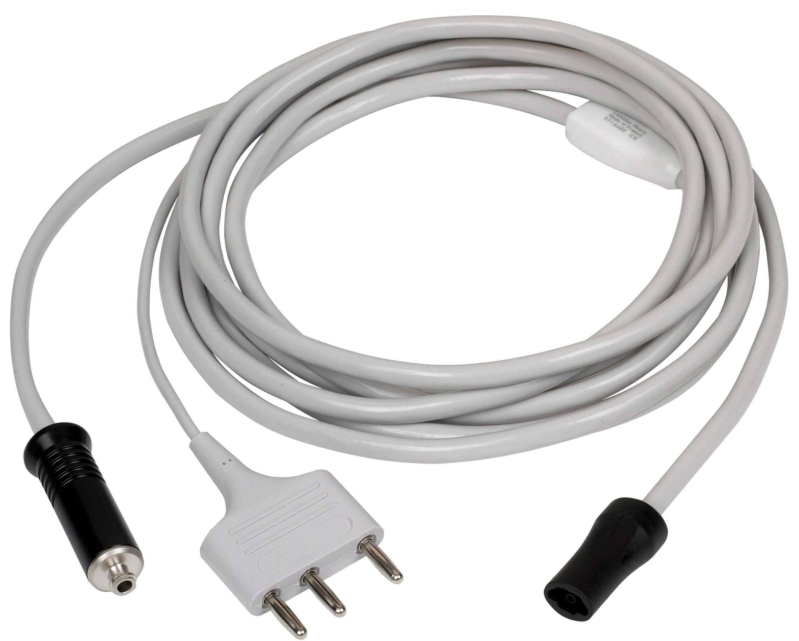
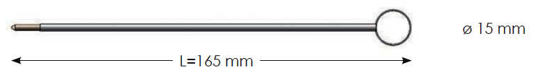
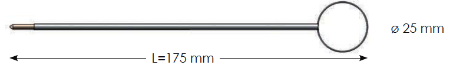
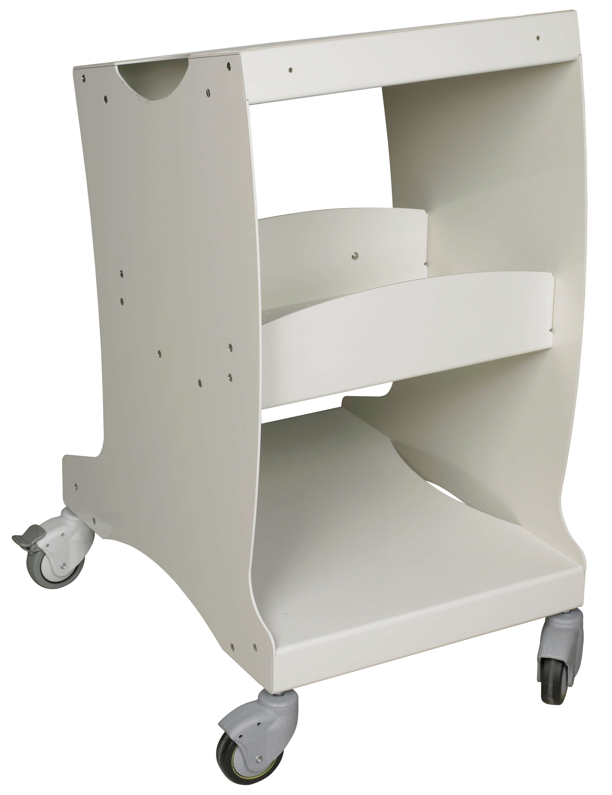
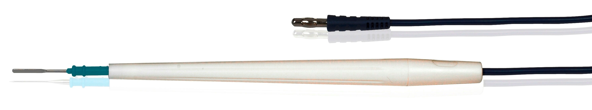
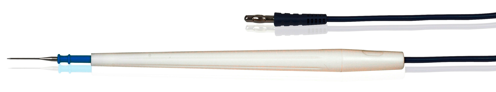
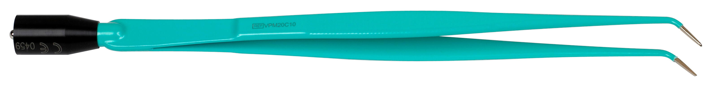

**Bienvenue dans le référentiel d'images Lamidey Noury Medical, mettant en vedette une variété d'outils médicaux de haute qualité. Explorez les différentes catégories ci-dessous pour découvrir les produits disponibles.**

## Table des Matières

  
Cliquez pour afficher

- [Adaptateurs](#adaptateurs)
- [Argons](#argons)
- [Câbles](#câbles)
- [Electrodes de Résection](#electrodes-de-résection)
- [Guéridon](#guéridon)
- [Manches](#manches)
- [Pédales](#pédales)
- [Pinces Monopolaires](#pinces-monopolaires)
- [Pinces Bipolaires](#pinces-bipolaires)
- [Plaques](#plaques)
- [Thermoclamp](#thermoclamp)
- [Thermocut](#thermocut)

## Adaptateurs
***Adaptateurs polyvalents pour différentes applications.***

- **Adaptateur V11KA88**
   
   
   
- **Adaptateur V11KA89**
   
   
   
- **Adaptateur V11KA91**
   
   
   
- **Adaptateur V11KA92**
   
   
   
- **Adaptateur V11KA94**
    
   
   
- **Adaptateur V11KA98**
    
   

## Argons
***Conçu pour une administration efficace d'argon médical.***

- **Argon V11A201**
   
   

- **Argon V11A301**
   
   

- **Argon V11A302**
   
   

- **Argon V11A303**
   
   

- **Argon V11A312**
   
   

- **Argon V11A313**
   
   

- **Argon V11A400**
   
   

- **Argon V11A401**
   
   

- **Argon V11A402**
   
   

- **Argon V11A403**
    
   

## Câbles
***Câbles dotés de connecteurs de qualité pour une transmission optimale.***

- **Câble V11F242-242TC**
   
   

- **Câble V11F242**
   
   

- **Câble V11F242C**
   
   

- **Câble V11F242E**
   
   

- **Câble V11F242TC**
    
   

- **Câble V11F342**
    
   

- **Câble V11F343**
    
   

- **Câble V11F345**
    
   

- **Câble V11F3AX**
   
   

- **Câble V11FM40**
    
   

- **Câble V11FM40P**
    
   

- **Câble V11FM43**
    
   

- **Câble V11FM44**
    
   

- **Câble V12PBS25DM**
    
   

- **Câble V12PBS25S**
    
   

- **Câble V12PBS26D**
    
   

- **Câble V12PBS26DM**
    
   

- **Câble V12PBS26M**
    
   

- **Câble V12PBS26S**
    
   

## Electrodes de Résection
***Performance fiable pour une résection précise.***

- **Électrode VRU01**
   
   

- **Électrode VRU011**
   
   

- **Électrode VRU11**
   
   

- **Électrode VRU21**
   
   

- **Électrode VRU31**
    
   

- **Électrode VRU41**
    
   

- **Électrode VRUB1**
    
   

- **Électrode VRUN1**
    
   

- **Électrode VRUV1**
    
   

## Electrodes Monopolaires 
### Anses
- **Électrode V11A52C**
   
   

- **Électrode V11A52L**
   
   

- **Électrode V11A52M**
   
   

- **Électrode V11A82C**
   
   

- **Électrode V11A82L**
   
   

- **Électrode V11A82M**
   
   

### Boules
- **Électrode V11B32L**
   
   

- **Électrode V11B32M**
   
   

- **Électrode V11B3CI**
    
   

- **Électrode V11B42L**
    
   

- **Électrode V11B42M**

   

- **Électrode V11B4CI**

   

## Couteaux

- **Électrode V11CC2L**

   

- **Électrode V11CC2M**

   

- **Électrode V11CCCI**

   

- **Électrode V11CCDI**

   

- **Électrode V11CCDTC**

   

- **Électrode V11CCDTC**

   

- **Électrode V11CCDX**

   

- **Électrode V11CD2L**

   

## Conisation

- **Électrode V11GCT2**

   

- **Électrode V11GCT3**

   

- **Électrode V11GCT4**

   

- **Électrode V11GCT21**

   

- **Électrode V11GCT22**

   

- **Électrode V11GCT31**

   

- **Électrode V11GCT32**

   

- **Électrode V11GCT41**

   

- **Électrode V11GCT42**

   

## UU

- **Électrode VEUC1**

   

- **Électrode VEUC2-VEUCL2**

   

- **Électrode VEUCL1**

   

- **Électrode VEUCL2**

   

- **Électrode VEUT1**

   

## Guéridon

Le guéridon V10GALP est un équipement médical essentiel, offrant une surface stable et pratique pour le positionnement d'instruments et de fournitures médicales pendant les procédures.

- **Guéridon V10GALP**

   

## Manches

Découvrez notre gamme de manches ergonomiques conçus pour une utilisation confortable et précise lors d'interventions médicales.

- **Manche VSUC1**

   

- **Manche VSUC15**

   

- **Manche VSUC2**

   

- **Manche VSUCL1**

   

- **Manche VSUEC1**

   
   
- **Manche VSUT1**
  
  

- **Manche VSUT2**
  
  

- **Manche V11MCT14**
  
  

- **Manche V11MCT9N**
  
  

## Pédales

Les pédales V11SM1DN et V11SM2FN offrent un contrôle précis et réactif, facilitant l'activation d'instruments médicaux compatibles.

- **Pédale V11SM1DN**
  
  

- **Pédale V11SM2FN**
  
  

## Pinces Monopolaires

***Découvrez notre sélection de pinces monopolaires offrant des performances fiables pour les procédures médicales.***

- **Pince Monopolaire VPM11D03**
  
  

- **Pince Monopolaire VPM13C10**
  
  

- **Pince Monopolaire VPM13D08G**
  
  

- **Pince Monopolaire VPM13D10**
  
  

- **Pince Monopolaire VPM13D12G**
  
  

- **Pince Monopolaire VPM16B10**
  
  

- **Pince Monopolaire VPM16C10**
  
  

- **Pince Monopolaire VPM16D08G**
  
  

- **Pince Monopolaire VPM16D10**
  
  

- **Pince Monopolaire VPM16D12G**
  
  

- **Pince Monopolaire VPM20B10**
  
  

- **Pince Monopolaire VPM20D08G**
  
  

- **Pince Monopolaire VPM20D10**
  
  

- **Pince Monopolaire VPM20D12G**
  
  

- **Pince Monopolaire VPM22C10**
  
  

- **Pince Monopolaire VPM22C20**
  
  

- **Pince Monopolaire VPM22D10**
  
  

- **Pince Monopolaire VPM22D25**
  
  

- **Pince Monopolaire VPMC20C10**
  
  

- **Pince Monopolaire VPMS16D10**
  
  

- **Pince Monopolaire VPMS20D10**
  
  

## Pinces Bipolaires

***Découvrez notre gamme de pinces bipolaires, conçues pour assurer une coagulation efficace avec une précision optimale.***

- **Pince Bipolaire VPB11C05**
  
  

- **Pince Bipolaire VPB11D03**
  
  

- **Pince Bipolaire VPB11D05**
  
  

- **Pince Bipolaire VPB11D10**
  
  

- **Pince Bipolaire VPB13C03**
  
  

- **Pince Bipolaire VPB13D05**
  
  

- **Pince Bipolaire VPB16B05**
  
  

- **Pince Bipolaire VPB16B10**
  
  

- **Pince Bipolaire VPB16C10**
  
  

- **Pince Bipolaire VPB16D03**
  
  

- **Pince Bipolaire VPB18C05**
  
  

- **Pince Bipolaire VPB18C10**
  
  

- **Pince Bipolaire VPB18D03**
  
  

- **Pince Bipolaire VPB18D10**
  
  

- **Pince Bipolaire VPB18D20**
  
  

- **Pince Bipolaire VPB20AR10**
  
  

- **Pince Bipolaire VPB20AV10**
  
  

- **Pince Bipolaire VPB20B03**
  
  

- **Pince Bipolaire VPB20B20**
  
  

- **Pince Bipolaire VPB20C10**
  
  

- **Pince Bipolaire VPB20C20**
  
  

- **Pince Bipolaire VPB20D03**
  
  

- **Pince Bipolaire VPB20D10**
  
  

- **Pince Bipolaire VPB20D20**
  
  

- **Pince Bipolaire VPB22B03**
  
  

- **Pince Bipolaire VPB22B10**
  
  

- **Pince Bipolaire VPB22C10**
  
  

- **Pince Bipolaire VPB22C20**
  
  

- **Pince Bipolaire VPB22D10**
  
  

- **Pince Bipolaire VPB22D20**
  
  

- **Pince Bipolaire VPB25B05-bis**
  
  

- **Pince Bipolaire VPB25B05**
  
  

- **Pince Bipolaire VPB25D10**
  
  

## Plaques

***Nos plaques offrent une interface sûre et fiable pour les procédures électrochirurgicales, assurant une dispersion efficace du courant électrique.***

- **Plaque VPLEN2**
  
  

- **Plaque VPLAD2**
  
  

- **Plaque V11IS1C**
  
  

- **Connecteur V11K250**
  
  

## Thermoclamp

   ***Les thermoclamps offrent un contrôle thermique précis lors des interventions chirurgicales, assurant la sécurité du patient et du personnel médical.***

- **Thermoclamp V11CLPBS2**
  
  

- **Thermoclamp V11CLPBS4**
  
  

- **Thermoclamp V11CLPBS6**
  
  

- **Thermoclamp V11CLPBS62**
  
  

## Thermocut

***Le Thermocut est conçu pour fournir des résultats fiables et une coagulation efficace, assurant la sécurité du patient et du personnel médical.***

- **Thermocut V12PBN211**
  
  

- **Thermocut V12PBN21P**
  
  

- **Thermocut V12PBN21R**
  
  

- **Thermocut V12PBN221**
  
  

- **Thermocut V12PBN22P**
  
  

- **Thermocut V12PBN22R**
  
  

- **Thermocut V12PBN2S**
  
  

- **Thermocut V12PBN52**
  
  

- **Thermocut V12PBN521R**
  
  

- **Thermocut V12PBN522R**
  
  

- **Thermocut V12PBN523**
  
  

- **Thermocut V12PBN5230**
  
  

- **Thermocut V12PBN524**
  
  

- **Thermocut V12PBN5240**
  
  

- **Thermocut V12PBS210**
  
  

- **Thermocut V12PBS220**
  
  

- **Thermocut V12PBS25DM**
  
  

- **Thermocut V12PBS25S**
  
  

- **Thermocut V12PBS26D**
  
  

- **Thermocut V12PBS26DM**
  
  

- **Thermocut V12PBS26M**
  
  

- **Thermocut V12PBS26S**
  
  

## Fiches technique

  
Cliquez pour afficher

### Adaptateurs
- [Adaptateurs](FT-Adaptateurs-210521_FR.pdf)

### Argons
- [Argons](FT-module_Argon-0822-FR.pdf)

### Câbles
- [Câbles](FT-Cables-210521_FR.pdf)

### Electrodes de Résection
- [Electrodes de Résection](FT-Electrode_gyneco_conisation-221006_FR.pdf)
- [Electrodes de Résection](FT-Electrode_aiguille_FR-200827.pdf)
- [Electrodes de Résection](FT-Electrode_anses_FR-200827.pdf)
- [Electrodes de Résection](FT-Electrode_boules_FR-201007.pdf)
- [Electrodes de Résection](FT-Electrode_couteaux_FR-201007.pdf)

### Anses
- [Anses](FT-anse_FRONT_LOAD_FR-220623.pdf)
- [Anses](FT-anse_Gynecare_FR-210812.pdf)
- [Anses](FT-anse_Reutilisable_FR-210812.pdf)
- [Anses](FT-anse_SIDE_LOAD_FR-220210.pdf)
- [Anses](FT-anse_Universelle_FR-220210.pdf)

### Manches
- [Manches](FT-manche_Derlec_FR-200720.pdf)
- [Manches](FT-manche_Tactilec_FR-200720.pdf)

### Pédales
- [Pédales](FT-Pédales_04_2019.pdf)

### Pinces Monopolaires
- [Pinces Monopolaires](Pinces_monopolaires_FT_0105_FR.pdf)

### Pinces Bipolaires
- [Pinces Bipolaires](FT-Pince_bipolaire_coudee-210129-FR.pdf)
- [Pinces Bipolaires](FT-Pince_bipolaire_droite-210129-FR.pdf)
- [Pinces Bipolaires](FT-Pinces_bipol_baionnettes-200828-FR.pdf)

### Plaques
- [Plaques](FT_Lames_Thermocut_FR.pdf)
- [Plaques](Thermocut5_FT_0722-FR.pdf)
- [Plaques](Thermocut10_FT-0722-FR.pdf)

### Thermoclamp
- [Thermoclamp](Pince_thermoclamp_et_Thermocision-FT_211116-FR.pdf)

### Thermocut
- [Thermocut](FT-Set_V11ELDI_FR-210202.pdf)
- [Thermocut](FT-Lames_Thermocut_FR.pdf)
- [Thermocut](Thermocut5_FT_0722-FR.pdf)
- [Thermocut](Thermocut10_FT-0722-FR.pdf)

## Crédits
Nous remercions les contributeurs suivants pour leur précieuse contribution à ce projet :
- [Mathéo NIGAUD CEBRON](https://github.com/adv2lnm)

## Mises à jour
Consultez la section [CHANGELOG.md](CHANGELOG.md) pour les dernières mises à jour et modifications apportées au projet.

## Support
Besoin d'aide ou avez-vous trouvé un problème ? Soumettez une demande d'assistance sur notre [page de support](https://lamidey-noury.com/) ou signalez un problème sur le courriel suivant: [mail de support](adv2@lamidey-noury.fr).
