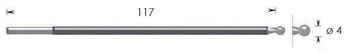

<<<<<<< HEAD
# Beautiful Jekyll

[](https://badge.fury.io/rb/beautiful-jekyll-theme)

> By [Dean Attali](https://deanattali.com) &middot; [Demo](https://beautifuljekyll.com/)

**Beautiful Jekyll** is a ready-to-use template to help you create a beautiful website quickly. Perfect for personal sites, blogs, or simple project websites.  [Check out a demo](https://beautifuljekyll.com) of what you'll get after just two minutes.  You can also look at [my personal website](https://deanattali.com) or [my consulting website](https://attalitech.com) to see it in use, or see [examples of websites](http://beautifuljekyll.com/examples) other people created using this theme.

**If you enjoy Beautiful Jekyll, please consider [supporting me](https://github.com/sponsors/daattali). You'll also gain access to office hours and more features! ❤**

## Table of contents

- [Features](#features)
- [Sponsors 🏆](#sponsors)
- [**Build your website in 3 steps**](#build-your-website-in-3-steps)
- [Plans](#plans)
- [Add your own content](#add-your-own-content)
- [Customizing parameters for each page](#customizing-parameters-for-each-page)
- [Supported parameters](#supported-parameters)
- [Featured users (success stories!)](#featured-users-success-stories)
- [Next steps](#next-steps)
- [Getting help](#getting-help)
- [Credits and contributions](#contributions)

# Features

__Check out [*What's New?*](https://beautifuljekyll.com/updates/) to see the latest features!__

- **SIMPLE**: The primary goal of Beautiful Jekyll is to allow literally *anyone* to create a website in a few minutes.
- **Modern**: Uses the latest best practices and technologies to achieve nearly perfect scores on Google Chrome's Audit.
- **Mobile-first**: Designed to look great on both large-screen and small-screen (mobile) devices.
- **Highly customizable**: Many personalization settings such as changing the background colour/image, adding a logo.
- **Flexible usage**: Use Beautiful Jekyll directly on GitHub or via a Ruby gem - choose the best [development method](#build-your-website-in-3-steps) for you.
- **Battle-tested**: By using Beautiful Jekyll, you'll be joining 50,000+ users enjoying this theme since 2015.
- **SEO and social media support**: Customize how your site looks on Google and when shared on social media.
- **Comments support**: Add comments to any page using either [Disqus](https://disqus.com/), [Facebook comments](https://developers.facebook.com/docs/plugins/comments), [Utterances](https://utteranc.es/), [Staticman](https://staticman.net), [giscus](https://giscus.app), or [CommentBox](https://commentbox.io/).
- **Tags**: Any blog post can be tagged with keywords, and an index page is automatically generated.
- **Analytics**: Easily integrate Google Analytics, or other analytics platforms, to track visits to your website.
- **Search**: Let users easily find any page using a Search button in the navigation bar.
- **Photos support**: Any page can have a full-width cover photo and thumbnail.
- **RSS**: An RSS feed is automatically created, so you can even host a podcast easily with Beautiful Jekyll.

<h2 id="sponsors">Sponsors 🏆</h2>

Developing and maintaining Beautiful Jekyll takes a lot of time and effort - thank you to anyone who helps fund this effort!

- [DoFollow](https://dofollow.co.uk/)
- [\_hyp3ri0n](https://hyperiongray.com)
- [Varna Sri Raman](https://about.me/varna)

**[Become a sponsor for Beautiful Jekyll and unlock new features\!](https://github.com/sponsors/daattali/sponsorships?tier_id=39856)**

# Build your website in 3 steps

There are a few different ways to build a website using Beautiful Jekyll, and this document will go through the simplest one: using a fork on GitHub. For most people (including myself!), this easy method is the recommended one.

Even if you choose to use one of the [advanced installation methods](https://beautifuljekyll.com/getstarted/#install-steps-hard), I still suggest you read through the easy method first.

## The easy way (recommended!)

Getting started is *literally* as easy as 1-2-3 :smile:

Scroll down to see the steps involved, but here is a 30-second video just as a reference as you work through the steps. If you don't already have a [GitHub account](https://github.com), you'll need to sign up.


### 1. Fork this project

Click on the __*Fork*__ button at the top right corner of this page. Forking means that you're copying this entire project and all its files into your account. Do not click on the __*Create fork*__ button on the next page yet.

### 2. Rename the repository to `YOURUSERNAME.github.io`

You'll see the word "repository" used a lot in GitHub - it simply means "project". Under __*Repository name*__ you should see the name `beautiful-jekyll`, this is where you need to rename your project to `YOURUSERNAME.github.io` (replace `YOURUSERNAME` with your GitHub user name). It's important to use this exact name so that GitHub will recognize it and automatically create a website for this project.   

> Tip: If you want to use a different URL for your website, check out the [FAQ](https://beautifuljekyll.com/faq/#custom-domain)
 
### 3. Customize your website settings

Edit the `_config.yml` file to change any settings you want. To edit the file, first click on it to view the file, and on the next page click on the pencil icon to edit it (watch the video tutorial above if you're confused).  The settings in the file are self-explanatory and there are comments inside the file to help you understand what each setting does. Any line that begins with a hashtag (`#`) is a comment, and the other lines are actual settings. After changing the settings, click the green __*Commit changes*__ button to save these edits.

> Note: In the video above, only one setting in the `_config.yml` file is edited, but you should go through the rest of the settings as well.

### 4. Congratulations! You have a website!

If you named your project correctly and made an edit to the config file, your website should be ready in a minute or two at `https://YOURUSERNAME.github.io`. Every time you make a change to any file, your website will get rebuilt and should be updated in about a minute or so. Your website will be initialized with several sample blog posts and a couple other pages.

## The harder way (for advanced users)

The instructions above explain how to use Beautiful Jekyll in the easiest way: by forking on GitHub. There are more [advanced installation methods](https://beautifuljekyll.com/getstarted/#install-steps-hard) that include either using GitHub Pages with remote themes, or using Ruby gems. They provide you with more control, but are only intended for advanced users.

> Note: Beautiful Jekyll was primarily designed to be used as a GitHub theme, so you will not get any support if you use this theme via Ruby gems. 

# Plans

Beautiful Jekyll is, and always will be, free. But if you want to remove the Beautiful Jekyll ad from your website, use a Dark Mode skin, access office hours, or simply support the development efforts, [check out the different plans](https://beautifuljekyll.com/plans).

# Add your own content

To add pages to your site, you can either write a markdown file (`.md`) or you can write an HTML file. It's much easier to write markdown than HTML, so that's the recommended approach ([here's a great tutorial](https://markdowntutorial.com/) if you need to learn markdown in 5 minutes).

To see an example of a markdown file, click on any file that ends in `.md`, for example [`aboutme.md`](./aboutme.md). On that page you can see some nicely formatted text (there's a word in bold, a link, a few bullet points), and if you click on the pencil icon to edit the file, you'll see the markdown code that generated the pretty text. Very easy! 

In contrast, look at [`tags.html`](./tags.html). That's how your write HTML - not as pretty. So stick with markdown if you don't know HTML.

Any markdown or HTML file that you create will be available on your website under `https://<yourusername>.github.io/<pagename>`. For example, if you create a file `about.md` (or `about.html`) then it'll exist at `https://<yourusername>.github.io/about`.

Files you create inside the [`_posts`](./_posts) directory will be treated as blog entries. You can look at the existing files there to get an idea of how to write blog posts. Note the format of the blog post files - they must follow the naming convention of `YEAR-MONTH-DAY-title.md`. After you successfully add your own post, you can delete the existing files inside [`_posts`](./_posts) to remove the sample posts, as those are just demo posts to help you learn.

# Customizing parameters for each page

**One last important thing**: In order to have your new pages use this template and not just be plain HTML pages, **you must add [YAML front matter](https://jekyllrb.com/docs/front-matter/) to the top of each page**:


```
---
---
```

This is where you'll be able to give each page some extra parameters (such as a title, a subtitle, an image, etc - [below is a list of all parameters](#supported-parameters)). Add any parameters you want between these two dashed lines, for example:

```
---
title: Contact me
subtitle: Here you'll find all the ways to get in touch with me
---
```

If you don't want to use any parameters on a page, you still need to use the two dashed lines. If you don't, then your file will be shown as-is without the Beautiful Jekyll template.

You can look at the top of [`aboutme.md`](https://raw.githubusercontent.com/daattali/beautiful-jekyll/master/aboutme.md) as an example.

**Important takeaway: ALWAYS add the YAML front matter, which is two lines of three dashes, to EVERY page. If you have any parameters, they go between the two lines.**

# Supported parameters

Below is a list of the parameters that Beautiful Jekyll supports (any of these can be added to the YAML front matter of any page). Remember to also look in the `_config.yml` file to see additional site-wide settings.

## Main parameters

These are the basic YAML parameters that you are most likely to use on most pages.

Parameter   | Description
----------- | -----------
title       | Page or blog post title
subtitle    | Short description of page or blog post that goes under the title
tags        | List of tags to categorize the post. Separate the tags with commas and place them inside square brackets. Example: `[personal, analysis, finance]`
cover-img   | Include a large full-width image at the top of the page. You can either provide the path to a single image (eg. `"/path/to/img"`) , or a list of images to cycle through (eg. `["/path/img1", "/path/img2"]`). If you want to add a caption to an image, then you must use the list notation (use `[]` even if you have only one image), and each image should be provided as `"/path/to/img" : "Caption of image"`.
thumbnail-img | For blog posts, if you want to add a thumbnail that will show up in the feed, use `thumbnail-img: /path/to/image`. If no thumbnail is provided, then `cover-img` will be used as the thumbnail. You can use `thumbnail-img: ""` to disable a thumbnail.
comments    | If you want do add comments to a specific page, use `comments: true`. Comments only work if you enable one of the comments providers (Facebook, disqus, staticman, utterances, giscus, CommentBox) in `_config.yml` file. Comments are automatically enabled on blog posts but not on other pages; to turn comments off for a specific post, use `comments: false`.

## Parameters for SEO and social media sharing

These parameters let you control what information shows up when a page is shown in a search engine (such as Google) or gets shared on social media (such as Twitter/Facebook).

Parameter   | Description
----------- | -----------
share-title | A title for the page. If not provided, then `title` will be used, and if that's missing then the site title (from `_config.yml`) is used.
share-description | A brief description of the page. If not provided, then `subtitle` will be used, and if that's missing then an excerpt from the page content is used.
share-img   | The image to show. If not provided, then `cover-img` or `thumbnail-img` will be used if one of them is provided.

## Less commonly used parameters

These are parameters that you may not use often, but can come in handy sometimes.

Parameter   | Description
----------- | -----------
author      | Specify the author of a blog post (useful if a website has multiple authors).
readtime    | If you want a post to show how many minutes it will take to read it, use `readtime: true`.
show-avatar | If you have an avatar configured in the `_config.yml` but you want to turn it off on a specific page, use `show-avatar: false`.
social-share | By default, every blog post has buttons to share the page on social media. If you want to turn this feature off, use `social-share: false`.
nav-short   | By default, the navigation bar gets shorter after scrolling down the page. If you want the navigation bar to always be short on a certain page, use `nav-short: true`
gh-repo   | If you want to show GitHub buttons at the top of a post, this sets the GitHub repo name (eg. `daattali/beautiful-jekyll`). You must also use the `gh-badge` parameter to specify what buttons to show.
gh-badge  | Select which GitHub buttons to display. Available options are: [star, watch, fork, follow]. You must also use the `gh-repo` parameter to specify the GitHub repo.
last-updated | If you want to show that a blog post was updated after it was originally released, you can specify an "Updated on" date.
layout      | What type of page this is (default is `post` for blog posts and `page` for other pages). See _Page types_ section below for more information.

## Advanced parameters

These are advanced parameters that are only useful for people who need very fine control over their website.

Parameter   | Description
----------- | -----------
footer-extra | If you want to include extra content below the social media icons in the footer, create an HTML file in the `_includes/` folder (for example `_includes/myinfo.html`) and set `footer-extra` to the name of the file (for example `footer-extra: myinfo.html`). Accepts a single file or a list of files.
before-content | Similar to `footer-extra`, but used for including HTML before the main content of the page (below the title).
after-content | Similar to `footer-extra`, but used for including HTML after the main content of the page (above the footer).
head-extra   | Similar to `footer-extra`, but used if you have any HTML code that needs to be included in the `<head>` tag of the page.
language    | HTML language code to be set on the page's &lt;html&gt; element.
full-width  | By default, page content is constrained to a standard width. Use `full-width: true` to allow the content to span the entire width of the window.
js          | List of local JavaScript files to include in the page (eg. `/assets/js/mypage.js`)
ext-js      | List of external JavaScript files to include in the page (eg. `//cdnjs.cloudflare.com/ajax/libs/underscore.js/1.8.2/underscore-min.js`). External JavaScript files that support [Subresource Integrity (SRI)](https://developer.mozilla.org/en-US/docs/Web/Security/Subresource_Integrity) can be specified using the `href` and `sri` parameters eg.<br/>`href: "//code.jquery.com/jquery-3.1.1.min.js"`<br/>`sri: "sha256-hVVnYaiADRTO2PzUGmuLJr8BLUSjGIZsDYGmIJLv2b8="`
css         | List of local CSS files to include in the page
ext-css      | List of external CSS files to include in the page. External CSS files using SRI (see `ext-js` parameter) are also supported.

## Page types

- **post** - To write a blog post, add a markdown or HTML file in the `_posts` folder. As long as you give it YAML front matter (the two lines of three dashes), it will automatically be rendered like a blog post. Look at the existing blog post files to see examples of how to use YAML parameters in blog posts.
- **page** - Any page outside the `_posts` folder that uses YAML front matter will have a very similar style to blog posts.
- **home** - The home layout is meant to act as the homepage of your blog posts - it will display all your blog posts, sorted from newest to oldest. A file using the `home` layout must be named `index.html` (not `index.md` or anything else!).
- **minimal** - If you want to create a page with minimal styling (ie. without the bulky navigation bar and footer), assign `layout: minimal` to the YAML front matter.
- If you want to completely bypass the template engine and just write your own HTML page, simply omit the YAML front matter. Only do this if you know how to write HTML!

# Featured users (success stories!)

Visit the [Official website](http://beautifuljekyll.com/examples) to see sample websites using Beautiful Jekyll.

If you'd like to showcase yourself and join this list, [upgrading to the Individual plan](https://github.com/sponsors/daattali/sponsorships?&tier_id=7362) will give you that publicity plus some other rewards!

# Next steps

Congratulations on making it this far! You now have all the tools to easily build a beautiful website for free. 

- After you get comfortable with the basics of writing in markdown, I suggest taking a look at this [sample post](https://beautifuljekyll.com/2020-02-28-sample-markdown/) and [the code that created it](https://raw.githubusercontent.com/daattali/beautiful-jekyll/master/_posts/2020-02-28-sample-markdown.md) to learn some more advanced tips about markdown.

- I highly recommend going over the [*Frequently Asked Questions*](https://beautifuljekyll.com/faq/) to find out answers to questions you may not even know you have. Every few months I suggest checking the [*What's New?*](https://beautifuljekyll.com/updates/) page to see if there are new features, and learn [how to update your site to the newest version](https://beautifuljekyll.com/faq/#updating) when it's time.

- You can also check out the [advanced installation methods](https://beautifuljekyll.com/getstarted/#install-steps-hard) that give you a little more control but are harder to use. Keep in mind that Beautiful Jekyll was primarily designed to be used as a GitHub theme, so you will not get any support if you choose one of the Ruby installation methods. 

# Getting help

Visit the [FAQ page](https://beautifuljekyll.com/faq) for answers to commonly asked questions.

**If you choose to [become a sponsor](https://beautifuljekyll.com/plans/), you'll have access to my [office hours](https://beautifuljekyll.com/officehours/) where you can ask for help.** You can also use the [Discussions](https://github.com/daattali/beautiful-jekyll/discussions) area to try and get help from the community.

Beautiful Jekyll is used by 50,000+ people with wildly varying degrees of web skills, so it's impossible to answer all the questions that may arise. For any question that's not specifically related to Beautiful Jekyll and is more about Jekyll or web development in general, the answer can often be found on Google, in the [Jekyll documentation](https://jekyllrb.com/), or on the [Jekyll support forum](https://talk.jekyllrb.com/).

# Contributions

Thank you to [all past contributors](https://github.com/daattali/beautiful-jekyll/graphs/contributors). If you find any problems or would like to contribute in any way, feel free to create a pull request/open an issue/send me a message.

You can also contribute by becoming an [official sponsor](https://github.com/sponsors/daattali/sponsorships?tier_id=39856) to help keep Beautiful Jekyll well-maintained!

# Credits

This template was not made *entirely* from scratch. I'd like to give special thanks to [Jekyll Now](https://github.com/barryclark/jekyll-now) and [Bootstrap Clean Blog](https://github.com/IronSummitMedia/startbootstrap-clean-blog), from whom I've taken several ideas initially.

I'd also like to thank [Dr. Jekyll's Themes](https://drjekyllthemes.github.io/), [Jekyll Themes](http://jekyllthemes.org/), and another [Jekyll Themes](http://jekyllrc.github.io/jekyllthemes/) for featuring Beautiful Jekyll in their Jekyll theme directories.

=======
**<span style="color:blue;">Bienvenue dans le référentiel d'images Lamidey Noury Medical, mettant en vedette une variété d'outils médicaux de haute qualité. Explorez les différentes catégories ci-dessous pour découvrir les produits disponibles.</span>**


## Table des Matières
<details>
  <summary>Cliquez pour afficher</summary>

- [Adaptateurs](#adaptateurs)
- [Argons](#argons)
- [Câbles](#câbles)
- [Electrodes de Résection](#electrodes-de-résection)
- [Guéridon](#guéridon)
- [Manches](#manches)
- [Pédales](#pédales)
- [Pinces Monopolaires](#pinces-monopolaires)
- [Pinces Bipolaires](#pinces-bipolaires)
- [Plaques](#plaques)
- [Thermoclamp](#thermoclamp)
- [Thermocut](#thermocut)

</details>


## Adaptateurs
***Adaptateurs polyvalents pour différentes applications.***

- **<span class="blue-text">Adaptateur V11KA88</span>**
   
   
   
- **<span class="blue-text">Adaptateur V11KA89</span>**
   
   
   
- **<span class="blue-text">Adaptateur V11KA91</span>**
   
   
   
- **<span class="blue-text">Adaptateur V11KA92</span>**
   
   
   
- **<span class="blue-text">Adaptateur V11KA94</span>**
    
   
   
- **<span class="blue-text">Adaptateur V11KA98</span>**
    
   


## Argons
***Conçu pour une administration efficace d'argon médical.***

- **<span class="blue-text">Argon V11A201</span>**
   
   

- **<span class="blue-text">Argon V11A301</span>**
   
   

- **<span class="blue-text">Argon V11A302</span>**
   
   

- **<span class="blue-text">Argon V11A303</span>**
   
   

- **<span class="blue-text">Argon V11A312</span>**
   
   

- **<span class="blue-text">Argon V11A313</span>**
   
   

- **<span class="blue-text">Argon V11A400</span>**
   
   

- **<span class="blue-text">Argon V11A401</span>**
   
   

- **<span class="blue-text">Argon V11A402</span>**
   
   

- **<span class="blue-text">Argon V11A403</span>**
    
   


## Câbles
***Câbles dotés de connecteurs de qualité pour une transmission optimale.***

- **<span class="blue-text">Câble V11F242-242TC</span>**
   
   

- **<span class="blue-text">Câble V11F242</span>**
   
   

- **<span class="blue-text">Câble V11F242C</span>**
   
   

- **<span class="blue-text">Câble V11F242E</span>**
   
   

- **<span class="blue-text">Câble V11F242TC</span>**
    
   

- **<span class="blue-text">Câble V11F342</span>**
    
   

- **<span class="blue-text">Câble V11F343</span>**
    
   

- **<span class="blue-text">Câble V11F345</span>**
    
   

- **<span class="blue-text">Câble V11F3AX</span>**
   
   

- **<span class="blue-text">Câble V11FM40</span>**
    
   

- **<span class="blue-text">Câble V11FM40P</span>**
    
   

- **<span class="blue-text">Câble V11FM43</span>**
    
   

- **<span class="blue-text">Câble V11FM44</span>**
    
   

- **<span class="blue-text">Câble V12PBS25DM</span>**
    
   

- **<span class="blue-text">Câble V12PBS25S</span>**
    
   

- **<span class="blue-text">Câble V12PBS26D</span>**
    
   

- **<span class="blue-text">Câble V12PBS26DM</span>**
    
   

- **<span class="blue-text">Câble V12PBS26M</span>**
    
   

- **<span class="blue-text">Câble V12PBS26S</span>**
    
   


## Electrodes de Résection
***Performance fiable pour une résection précise.***

- **<span class="blue-text">Électrode VRU01</span>**
   
   

- **<span class="blue-text">Électrode VRU011</span>**
   
   

- **<span class="blue-text">Électrode VRU11</span>**
   
   

- **<span class="blue-text">Électrode VRU21</span>**
   
   

- **<span class="blue-text">Électrode VRU31</span>**
    
   

- **<span class="blue-text">Électrode VRU41</span>**
    
   

- **<span class="blue-text">Électrode VRUB1</span>**
    
   

- **<span class="blue-text">Électrode VRUN1</span>**
    
   

- **<span class="blue-text">Électrode VRUV1</span>**
    
   


## Electrodes Monopolaires 
### Anses
- **<span class="blue-text">Électrode V11A52C</span>**
   
   

- **<span class="blue-text">Électrode V11A52L</span>**
   
   

- **<span class="blue-text">Électrode V11A52M</span>**
   
   

- **<span class="blue-text">Électrode V11A82C</span>**
   
   

- **<span class="blue-text">Électrode V11A82L</span>**
   
   

- **<span class="blue-text">Électrode V11A82M</span>**
   
   

### Boules
- **<span class="blue-text">Électrode V11B32L</span>**
   
   

- **<span class="blue-text">Électrode V11B32M</span>**
   
   

- **<span class="blue-text">Électrode V11B3CI</span>**
    
   

- **<span class="blue-text">Électrode V11B42L</span>**
    
   

- **<span class="blue-text">Électrode V11B42M</span>**

   

- **<span class="blue-text">Électrode V11B4CI</span>**

   

### Couteaux

- **<span class="blue-text">Électrode V11CC2L</span>**

   

- **<span class="blue-text">Électrode V11CC2M</span>**

   

- **<span class="blue-text">Électrode V11CCCI</span>**

   

- **<span class="blue-text">Électrode V11CCDI</span>**

   

- **<span class="blue-text">Électrode V11CCDTC</span>**

   

- **<span class="blue-text">Électrode V11CCDTC</span>**

   

- **<span class="blue-text">Électrode V11CCDX</span>**

   

- **<span class="blue-text">Électrode V11CD2L</span>**

   

### Conisation

- **<span class="blue-text">Électrode V11GCT2</span>**

   

- **<span class="blue-text">Électrode V11GCT3</span>**

   

- **<span class="blue-text">Électrode V11GCT4</span>**

   

- **<span class="blue-text">Électrode V11GCT21</span>**

   

- **<span class="blue-text">Électrode V11GCT22</span>**

   

- **<span class="blue-text">Électrode V11GCT31</span>**

   

- **<span class="blue-text">Électrode V11GCT32</span>**

   

- **<span class="blue-text">Électrode V11GCT41</span>**

   

- **<span class="blue-text">Électrode V11GCT42</span>**

   

### UU

- **<span class="blue-text">Électrode VEUC1</span>**

   

- **<span class="blue-text">Électrode VEUC2-VEUCL2</span>**

   

- **<span class="blue-text">Électrode VEUCL1</span>**

   

- **<span class="blue-text">Électrode VEUCL2</span>**

   

- **<span class="blue-text">Électrode VEUT1</span>**

   

## Guéridon

***Le guéridon V10GALP est un équipement médical essentiel, offrant une surface stable et pratique pour le positionnement d'instruments et de fournitures médicales pendant les procédures.***

- **<span class="blue-text">Guéridon V10GALP</span>**

   

## Manches

***Découvrez notre gamme de manches ergonomiques conçus pour une utilisation confortable et précise lors d'interventions médicales.***

- **<span class="blue-text">Manche VSUC1</span>**

   

- **<span class="blue-text">Manche VSUC15</span>**

   

- **<span class="blue-text">Manche VSUC2</span>**

   

- **<span class="blue-text">Manche VSUCL1</span>**

   

- **<span class="blue-text">Manche VSUEC1</span>**

   
   
- **Manche VSUT1**
  
  

- **Manche VSUT2**
  
  

- **Manche V11MCT14**
  
  

- **Manche V11MCT9N**
  
  

## Pédales

***Les pédales V11SM1DN et V11SM2FN offrent un contrôle précis et réactif, facilitant l'activation d'instruments médicaux compatibles.***

- **Pédale V11SM1DN**
  
  

- **Pédale V11SM2FN**
  
  

## Pinces Monopolaires

***Découvrez notre sélection de pinces monopolaires offrant des performances fiables pour les procédures médicales.***

- **Pince Monopolaire VPM11D03**
  
  

- **Pince Monopolaire VPM13C10**
  
  

- **Pince Monopolaire VPM13D08G**
  
  

- **Pince Monopolaire VPM13D10**
  
  

- **Pince Monopolaire VPM13D12G**
  
  

- **Pince Monopolaire VPM16B10**
  
  

- **Pince Monopolaire VPM16C10**
  
  

- **Pince Monopolaire VPM16D08G**
  
  

- **Pince Monopolaire VPM16D10**
  
  

- **Pince Monopolaire VPM16D12G**
  
  

- **Pince Monopolaire VPM20B10**
  
  

- **Pince Monopolaire VPM20D08G**
  
  

- **Pince Monopolaire VPM20D10**
  
  

- **Pince Monopolaire VPM20D12G**
  
  

- **Pince Monopolaire VPM22C10**
  
  

- **Pince Monopolaire VPM22C20**
  
  

- **Pince Monopolaire VPM22D10**
  
  

- **Pince Monopolaire VPM22D25**
  
  

- **Pince Monopolaire VPMC20C10**
  
  

- **Pince Monopolaire VPMS16D10**
  
  

- **Pince Monopolaire VPMS20D10**
  
  

## Pinces Bipolaires

***Découvrez notre gamme de pinces bipolaires, conçues pour assurer une coagulation efficace avec une précision optimale.***

- **<span class="blue-text">Pince Bipolaire VPB11C05</span>**
  
  

- **<span class="blue-text">Pince Bipolaire VPB11D03</span>**
  
  

- **<span class="blue-text">Pince Bipolaire VPB11D05</span>**
  
  

- **<span class="blue-text">Pince Bipolaire VPB11D10</span>**
  
  

- **<span class="blue-text">Pince Bipolaire VPB13C03</span>**
  
  

- **<span class="blue-text">Pince Bipolaire VPB13D05</span>**
  
  

- **<span class="blue-text">Pince Bipolaire VPB16B05</span>**
  
  

- **<span class="blue-text">Pince Bipolaire VPB16B10</span>**
  
  

- **<span class="blue-text">Pince Bipolaire VPB16C10</span>**
  
  

- **<span class="blue-text">Pince Bipolaire VPB16D03</span>**
  
  

- **<span class="blue-text">Pince Bipolaire VPB18C05</span>**
  
  

- **<span class="blue-text">Pince Bipolaire VPB18C10</span>**
  
  

- **<span class="blue-text">Pince Bipolaire VPB18D03</span>**
  
  

- **<span class="blue-text">Pince Bipolaire VPB18D10</span>**
  
  

- **<span class="blue-text">Pince Bipolaire VPB18D20</span>**
  
  

- **<span class="blue-text">Pince Bipolaire VPB20AR10</span>**
  
  

- **<span class="blue-text">Pince Bipolaire VPB20AV10</span>**
  
  

- **<span class="blue-text">Pince Bipolaire VPB20B03</span>**
  
  

- **<span class="blue-text">Pince Bipolaire VPB20B20</span>**
  
  

- **<span class="blue-text">Pince Bipolaire VPB20C10</span>**
  
  

- **<span class="blue-text">Pince Bipolaire VPB20C20</span>**
  
  

- **<span class="blue-text">Pince Bipolaire VPB20D03</span>**
  
  

- **<span class="blue-text">Pince Bipolaire VPB20D10</span>**
  
  

- **<span class="blue-text">Pince Bipolaire VPB20D20</span>**
  
  

- **<span class="blue-text">Pince Bipolaire VPB22B03</span>**
  
  

- **<span class="blue-text">Pince Bipolaire VPB22B10</span>**
  
  

- **<span class="blue-text">Pince Bipolaire VPB22C10</span>**
  
  

- **<span class="blue-text">Pince Bipolaire VPB22C20</span>**
  
  

- **<span class="blue-text">Pince Bipolaire VPB22D10</span>**
  
  

- **<span class="blue-text">Pince Bipolaire VPB22D20</span>**
  
  

- **<span class="blue-text">Pince Bipolaire VPB25B05-bis</span>**
  
  

- **<span class="blue-text">Pince Bipolaire VPB25B05</span>**
  
  

- **<span class="blue-text">Pince Bipolaire VPB25D10</span>**
  
  

## Plaques

***Nos plaques offrent une interface sûre et fiable pour les procédures électrochirurgicales, assurant une dispersion efficace du courant électrique.***

- **<span class="blue-text">Plaque VPLEN2</span>**
  
  

- **<span class="blue-text">Plaque VPLAD2</span>**
  
  

- **<span class="blue-text">Plaque V11IS1C</span>**
  
  

- **<span class="blue-text">Connecteur V11K250</span>**
  
  

## Thermoclamp

   ***Les thermoclamps offrent un contrôle thermique précis lors des interventions chirurgicales, assurant la sécurité du patient et du personnel médical.***

- **<span class="blue-text">Thermoclamp V11CLPBS2</span>**
  
  

- **<span class="blue-text">Thermoclamp V11CLPBS4</span>**
  
  

- **<span class="blue-text">Thermoclamp V11CLPBS6</span>**
  
  

- **<span class="blue-text">Thermoclamp V11CLPBS62</span>**
  
  

## Thermocut

***Le Thermocut est conçu pour fournir des résultats fiables et une coagulation efficace, assurant la sécurité du patient et du personnel médical.***

- **<span class="blue-text">Thermocut V12PBN211</span>**
  
  

- **<span class="blue-text">Thermocut V12PBN21P</span>**
  
  

- **<span class="blue-text">Thermocut V12PBN21R</span>**
  
  

- **<span class="blue-text">Thermocut V12PBN221</span>**
  
  

- **<span class="blue-text">Thermocut V12PBN22P</span>**
  
  

- **<span class="blue-text">Thermocut V12PBN22R</span>**
  
  

- **<span class="blue-text">Thermocut V12PBN2S</span>**
  
  

- **<span class="blue-text">Thermocut V12PBN52</span>**
  
  

- **<span class="blue-text">Thermocut V12PBN521R</span>**
  
  

- **<span class="blue-text">Thermocut V12PBN522R</span>**
  
  

- **<span class="blue-text">Thermocut V12PBN523</span>**
  
  

- **<span class="blue-text">Thermocut V12PBN5230</span>**
  
  

- **<span class="blue-text">Thermocut V12PBN524</span>**
  
  

- **<span class="blue-text">Thermocut V12PBN5240</span>**
  
  

- **<span class="blue-text">Thermocut V12PBS210</span>**
  
  

- **<span class="blue-text">Thermocut V12PBS220</span>**
  
  

- **<span class="blue-text">Thermocut V12PBS25DM</span>**
  
  

- **<span class="blue-text">Thermocut V12PBS25S</span>**
  
  

- **<span class="blue-text">Thermocut V12PBS26D</span>**
  
  

- **<span class="blue-text">Thermocut V12PBS26DM</span>**
  
  

- **<span class="blue-text">Thermocut V12PBS26M</span>**
  
  

- **<span class="blue-text">Thermocut V12PBS26S</span>**
  
  


## Fiches technique

<details>
  <summary>Cliquez pour afficher</summary>

### Adaptateurs
- [Adaptateurs](FT-Adaptateurs-210521_FR.pdf)

### Argons
- [Argons](FT-module_Argon-0822-FR.pdf)

### Câbles
- [Câbles](FT-Cables-210521_FR.pdf)

### Electrodes de Résection
- [Electrodes de Résection](FT-Electrode_gyneco_conisation-221006_FR.pdf)
- [Electrodes de Résection](FT-Electrode_aiguille_FR-200827.pdf)
- [Electrodes de Résection](FT-Electrode_anses_FR-200827.pdf)
- [Electrodes de Résection](FT-Electrode_boules_FR-201007.pdf)
- [Electrodes de Résection](FT-Electrode_couteaux_FR-201007.pdf)

### Anses
- [Anses](FT-anse_FRONT_LOAD_FR-220623.pdf)
- [Anses](FT-anse_Gynecare_FR-210812.pdf)
- [Anses](FT-anse_Reutilisable_FR-210812.pdf)
- [Anses](FT-anse_SIDE_LOAD_FR-220210.pdf)
- [Anses](FT-anse_Universelle_FR-220210.pdf)

### Manches
- [Manches](FT-manche_Derlec_FR-200720.pdf)
- [Manches](FT-manche_Tactilec_FR-200720.pdf)

### Pédales
- [Pédales](FT-Pédales_04_2019.pdf)

### Pinces Monopolaires
- [Pinces Monopolaires](Pinces_monopolaires_FT_0105_FR.pdf)

### Pinces Bipolaires
- [Pinces Bipolaires](FT-Pince_bipolaire_coudee-210129-FR.pdf)
- [Pinces Bipolaires](FT-Pince_bipolaire_droite-210129-FR.pdf)
- [Pinces Bipolaires](FT-Pinces_bipol_baionnettes-200828-FR.pdf)

### Plaques
- [Plaques](FT_Lames_Thermocut_FR.pdf)
- [Plaques](Thermocut5_FT_0722-FR.pdf)
- [Plaques](Thermocut10_FT-0722-FR.pdf)

### Thermoclamp
- [Thermoclamp](Pince_thermoclamp_et_Thermocision-FT_211116-FR.pdf)

### Thermocut
- [Thermocut](FT-Set_V11ELDI_FR-210202.pdf)
- [Thermocut](FT-Lames_Thermocut_FR.pdf)
- [Thermocut](Thermocut5_FT_0722-FR.pdf)
- [Thermocut](Thermocut10_FT-0722-FR.pdf)

</details>


## Crédits
Nous remercions les contributeurs suivants pour leur précieuse contribution à ce projet :
- [Mathéo NIGAUD CEBRON](https://github.com/adv2lnm)

## Mises à jour
Consultez la section [CHANGELOG.md](CHANGELOG.md) pour les dernières mises à jour et modifications apportées au projet.

## Support
Besoin d'aide ou avez-vous trouvé un problème ? Soumettez une demande d'assistance sur notre [page de support](https://lamidey-noury.com/) ou signalez un problème sur le courriel suivant: [mail de support](adv2@lamidey-noury.fr).
>>>>>>> f8a5c0f33c32d9f19cb03b2404022322a5ddd027
