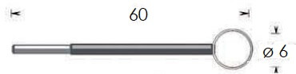
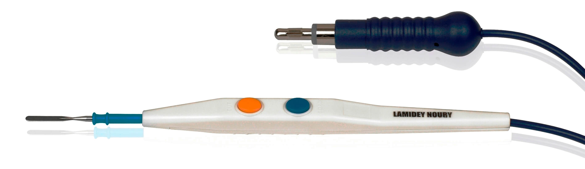
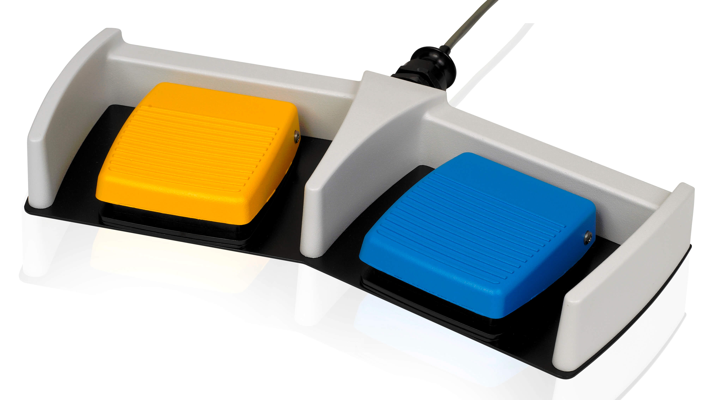
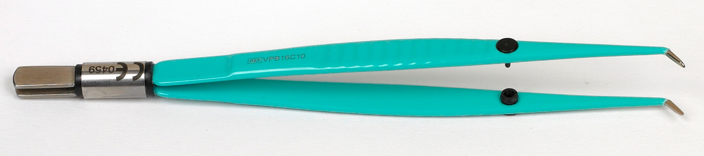

# Lamidey-Noury-images
Bienvenue dans le référentiel d'images Lamidey-Noury, mettant en vedette une variété d'outils médicaux de haute qualité. Explorez les différentes catégories ci-dessous pour découvrir les produits disponibles.

## Table des Matières
- [Adaptateurs](#adaptateurs)
- [Argons](#argons)
- [Câbles](#câbles)
- [Electrodes de Résection](#electrodes-de-résection)
- [Guéridon](#guéridon)
- [Manches](#manches)
- [Pédales](#pédales)
- [Pinces Monopolaires](#pinces-monopolaires)
- [Pinces Bipolaires](#pinces-bipolaires)
- [Plaques](#plaques)
- [Thermoclamp](#thermoclamp)
- [Thermocut](#thermocut)

## Adaptateurs
- Adaptateurs polyvalent pour différentes applications.

1.  - **Adaptateur V11KA88**
2.  - **Adaptateur V11KA89**
3.  - **Adaptateur V11KA91**
4.  - **Adaptateur V11KA92**
5.  - **Adaptateur V11KA94**
6.  - **Adaptateur V11KA98**

## Argons
- Conçu pour une administration efficace d'argon médical.

1.  - **Argon V11A201**
3.  - **Argon V11A301**
5.  - **Argon V11A302**
7.  - **Argon V11A303**
8.  - **Argon V11A312**
10.  - **Argon V11A313**
11.  - **Argon V11A400**
12.  - **Argon V11A401**
13.  - **Argon V11A402**
14.  - **Argon V11A403**

## Câbles
- Câbles dotés de connecteurs de qualité pour une transmission optimale.
  
1.  - **Câble V11F242-242TC**
2.  - **Câble V11F242**
3.  - **Câble V11F242C**
4.  - **Câble V11F242E**
5.  - **Câble V11F242TC**
6.  - **Câble V11F342**
7.  - **Câble V11F343**
8.  - **Câble V11F345**
9.  - **Câble V11F3AX bis**
10.  - **Câble V11F3AX**
11.  - **Câble V11FM40**
12.  - **Câble V11FM40P**
13.  - **Câble V11FM43**
14.  - **Câble V11FM44**
15.  - **Câble V12PBS25DM**
16.  - **Câble V12PBS25S**
17.  - **Câble V12PBS26D**
18.  - **Câble V12PBS26DM**
19.  - **Câble V12PBS26M**
20.  - **Câble V12PBS26S**

## Electrodes de résection
- Performance fiable pour une résection précise.
  
1.  - **Électrode VRU01**
2.  - **Électrode VRU011**
3.  - **Électrode VRU11**
4.  - **Électrode VRU21**
5.  - **Électrode VRU31**
6.  - **Électrode VRU41**
7.  - **Électrode VRUB1**
8.  - **Électrode VRUN1**
9.  - **Électrode VRUV1**
10.  - **Électrode V11A52C**
11.  - **Électrode V11A52L**
12.  - **Électrode V11A52M**
13.  - **Électrode V11A82C**
14.  - **Électrode V11A82L**
15.  - **Électrode V11A82M**
16.  - **Électrode V11B32L**
17.  - **Électrode V11B32M**
18.  - **Électrode V11B3CI**
19.  - **Électrode V11B42L**
20.  - **Électrode V11B42M**
21.  - **Électrode V11B4CI**
22.  - **Électrode V11B52L**
23.  - **Électrode V11B52M**
24.  - **Électrode V11B5CI**
25.  - **Électrode V11B82L**
26.  - **Électrode V11B82M**
27.  - **Électrode V11B8CI**
28.  - **Électrode V11CC2L**
29.  - **Électrode V11CC2M**
30.  - **Électrode V11CCCI**
31.  - **Électrode V11CCDI**
32.  - **Électrode V11CCDTC**
33.  - **Électrode V11CCDTC**
34.  - **Électrode V11CCDX**
35.  - **Électrode V11CD2L**

## Guéridon
  - Le guéridon V10GALP est un équipement médical essentiel, offrant une surface stable et pratique pour le positionnement d'instruments et de fournitures médicales pendant les procédures.
    
1.  - **Guéridon V10GALP**
 

## Manches
 - Découvrez notre gamme de manches ergonomiques conçus pour une utilisation confortable et précise lors d'interventions médicales.

1.  - **Manche VSUC1**
2.  - **Manche VSUC15**
3.  - **Manche VSUC2**
4.  - **Manche VSUCL1**
5.  - **Manche VSUEC1**
6.  - **Manche VSUT1**
7.  - **Manche VSUT2**
8.  - **Manche V11MCT14**
9.  - **Manche V11MCT9N bis**
10.  - **Manche V11MCT9N ter**
11.  - **Manche V11MCT9N**
  
## Pédales
 - Les pédales V11SM1DN et V11SM2FN offrent un contrôle précis et réactif, facilitant l'activation d'instruments médicaux compatibles.
   
1.  - **Pédale V11SM1DN**
2.  - **Pédale V11SM2FN**

## Pinces Monopolaires

1.  - **Pince Monopolaire VPM11D03**
2.  - **Pince Monopolaire VPM13C10**
3.  - **Pince Monopolaire VPM13D08G**
4.  - **Pince Monopolaire VPM13D10**
5.  - **Pince Monopolaire VPM13D10**
6.  - **Pince Monopolaire VPM13D12G**
7.  - **Pince Monopolaire VPM16B10**
8.  - **Pince Monopolaire VPM16C10**
9.  - **Pince Monopolaire VPM16D08G**
10.  - **Pince Monopolaire VPM16D10**
11.  - **Pince Monopolaire VPM16D12G**
12.  - **Pince Monopolaire VPM20B10**
13.  - **Pince Monopolaire VPM20D08G**
14.  - **Pince Monopolaire VPM20D10**
15.  - **Pince Monopolaire VPM20D12G**
16.  - **Pince Monopolaire VPM22C10**
17.  - **Pince Monopolaire VPM22C20**
18.  - **Pince Monopolaire VPM22D10**
19.  - **Pince Monopolaire VPM22D25**
20.  - **Pince Monopolaire VPMC20C10**
21.  - **Pince Monopolaire VPMS16D10**
22.  - **Pince Monopolaire VPMS20D10**
   - Découvrez notre sélection de pinces monopolaires offrant des performances fiables pour les procédures médicales.

## Pinces Bipolaires
  - Découvrez notre gamme de pinces bipolaires, conçues pour assurer une coagulation efficace avec une précision optimale.
    
1.  - **Pince Bipolaire VPB11C05**
2.  - **Pince Bipolaire VPB11D03**
3.  - **Pince Bipolaire VPB11D05**
4.  - **Pince Bipolaire VPB11D10**
5.  - **Pince Bipolaire VPB13C03**
6.  - **Pince Bipolaire VPB13D05**
7.  - **Pince Bipolaire VPB16B05**
8.  - **Pince Bipolaire VPB16B10**
9.  - **Pince Bipolaire VPB16C10**
10.  - **Pince Bipolaire VPB16C10**
11.  - **Pince Bipolaire VPB16D03**
12.  - **Pince Bipolaire VPB18C05**
13.  - **Pince Bipolaire VPB18C10**
14.  - **Pince Bipolaire VPB18D03**
15.  - **Pince Bipolaire VPB18D10**
16.  - **Pince Bipolaire VPB18D20**
17.  - **Pince Bipolaire VPB20AR10**
18.  - **Pince Bipolaire VPB20AV10**
19.  - **Pince Bipolaire VPB20B03**
20.  - **Pince Bipolaire VPB20B20**
21.  - **Pince Bipolaire VPB20C10**
22.  - **Pince Bipolaire VPB20C20**
23.  - **Pince Bipolaire VPB20D03**
24.  - **Pince Bipolaire VPB20D10 bis**
25.  - **Pince Bipolaire VPB20D10**
26.  - **Pince Bipolaire VPB20D20**
27.  - **Pince Bipolaire VPB22B03**
28.  - **Pince Bipolaire VPB22B10**
29.  - **Pince Bipolaire VPB22C10**
30.  - **Pince Bipolaire VPB22C20**
31.  - **Pince Bipolaire VPB22D10**
32.  - **Pince Bipolaire VPB22D20**
33.  - **Pince Bipolaire VPB25B05-bis**
34.  - **Pince Bipolaire VPB25B05**
35.  - **Pince Bipolaire VPB25D10**

## Plaques
   - Nos plaques offrent une interface sûre et fiable pour les procédures électrochirurgicales, assurant une dispersion efficace du courant électrique.
     
1.  - **Plaque VPLEN2**
2.  - **Plaque VPLAD2**

## Thermoclamp
 - Les thermoclamps offrent un contrôle thermique précis lors des interventions chirurgicales, assurant la sécurité du patient et du personnel médical.

1.  - **Thermoclamp V11CLPBS2**
2.  - **Thermoclamp V11CLPBS2 (détail)**
3.  - **Thermoclamp V11CLPBS2**
4.  - **Thermoclamp V11CLPBS4**
5.  - **Thermoclamp V11CLPBS6**
6.  - **Thermoclamp V11CLPBS62**
  
## Thermocut
- Le Thermocut est conçu pour fournir des résultats fiables et une coagulation efficace, assurant la sécurité du patient et du personnel médical.

1.  - **Thermocut V12PBN211**
2.  - **Thermocut V12PBN21P**
3.  - **Thermocut V12PBN21R**
4.  - **Thermocut V12PBN221**
5.  - **Thermocut V12PBN22P**
6.  - **Thermocut V12PBN22R**
7.  - **Thermocut V12PBN2S**
8.  - **Thermocut V12PBN52**
9.  - **Thermocut V12PBN521R**
10.  - **Thermocut V12PBN522R**
11.  - **Thermocut V12PBN523**
12.  - **Thermocut V12PBN5230**
13.  - **Thermocut V12PBN524**
14.  - **Thermocut V12PBN5240**
15.  - **Thermocut V12PBS210**
16.  - **Thermocut V12PBS220**
17.  - **Thermocut V12PBS25DM**
18.  - **Thermocut V12PBS25S**
19.  - **Thermocut V12PBS26D**
20.  - **Thermocut V12PBS26DM**
21.  - **Thermocut V12PBS26M**
22.  - **Thermocut V12PBS26S**
23.  - **Lame VSU9000**

24. ## Liens vers les fiches techniques
Consultez la documentation complète sur l'utilisation de ces éléments auprès des fiches techniques en fichier PDF [ici] 
- [FT_Lames Thermocut_FR.pdf](PDFs/FT_Lames_Thermocut_FR.pdf)
- [Thermocut 5_FT_0722-FR.pdf](PDFs/Thermocut5_FT_0722-FR.pdf)
- [Thermocut10_FT-0722-FR.pdf](PDFs/Thermocut10_FT-0722-FR.pdf)
- [Pince thermoclamp et Thermocision-FT_211116-FR.pdf](PDFs/Pince_thermoclamp_et_Thermocision-FT_211116-FR.pdf)
- [SILIPLAQUE C_ FT-0914_Rev1.pdf](PDFs/SILIPLAQUE_C_FT-0914_Rev1.pdf)
- [FT-Pince bipolaire coudee-210129-FR.pdf](PDFs/FT-Pince_bipolaire_coudee-210129-FR.pdf)
- [FT-Pince bipolaire droite-210129-FR.pdf](PDFs/FT-Pince_bipolaire_droite-210129-FR.pdf)
- [FT-Pinces bipol.baïonnettes-200828-FR.pdf](PDFs/FT-Pinces_bipol_baionnettes-200828-FR.pdf)
- [Pinces monopolaires FT 0105 FR.pdf](PDFs/Pinces_monopolaires_FT_0105_FR.pdf)
- [FT-module Argon-0822-FR.pdf](PDFs/FT-module_Argon-0822-FR.pdf)
- [FT-Pédales_04_2019.pdf](PDFs/FT-Pedales_04_2019.pdf)
- [FT-Electrode aiguille FR-200827.pdf](PDFs/FT-Electrode_aiguille_FR-200827.pdf)
- [FT-Electrode anses FR-200827.pdf](PDFs/FT-Electrode_anses_FR-200827.pdf)
- [FT-Electrode boules FR-201007.pdf](PDFs/FT-Electrode_boules_FR-201007.pdf)
- [FT-Electrode couteaux FR-201007.pdf](PDFs/FT-Electrode_couteaux_FR-201007.pdf)
- [FT-Electrode gynéco conisation-221006_FR.pdf](PDFs/FT-Electrode_gyneco_conisation-221006_FR.pdf)
- [FT-manche Derlec FR-200720.pdf](PDFs/FT-manche_Derlec_FR-200720.pdf)
- [FT-manche Tactilec FR-200720.pdf](PDFs/FT-manche_Tactilec_FR-200720.pdf)
- [FT-Set V11ELDI FR-210202.pdf](PDFs/FT-Set_V11ELDI_FR-210202.pdf)
- [FT-anse FRONT LOAD -FR- 220623.pdf](PDFs/FT-anse_FRONT_LOAD_FR-220623.pdf)
- [FT-anse Gynecare -FR-210812.pdf](PDFs/FT-anse_Gynecare_FR-210812.pdf)
- [FT-anse Réutilisable -FR- 210812.pdf](PDFs/FT-anse_Reutilisable_FR-210812.pdf)
- [FT-anse SIDE LOAD -FR- 220210.pdf](PDFs/FT-anse_SIDE_LOAD_FR-220210.pdf)
- [FT-anse Universelle -FR- 220210.pdf](PDFs/FT-anse_Universelle_FR-220210.pdf)
- [FT-Poignées SIDE LOAD_FR-210826.pdf](PDFs/FT-Poignees_SIDE_LOAD_FR-210826.pdf)
- [FT-Adaptateurs-210521_FR.pdf](PDFs/FT-Adaptateurs-210521_FR.pdf)
- [FT-Câbles-210521_FR.pdf](PDFs/FT-Cables-210521_FR.pdf).

## Optimisation des images
Les images incluses dans ce référentiel sont optimisées pour une taille de fichier réduite, garantissant des temps de chargement efficaces.

## Crédits
Nous remercions les contributeurs suivants pour leur précieuse contribution à ce projet :
- [Mathéo NIGAUD CEBRON](https://github.com/adv2lnm)

## Mises à jour
Consultez la section [CHANGELOG.md](CHANGELOG.md) pour les dernières mises à jour et modifications apportées au projet.

## Support
Besoin d'aide ou avez-vous trouvé un problème ? Soumettez une demande d'assistance sur notre [page de support](https://lamidey-noury.com/) ou signalez un problème sur le courriel suivant: [mail de support](adv2@lamidey-noury.fr).

## Liens vers des ressources externes
- [Projet externe 1](https://projetexterne1.com)
- [Projet externe 2](https://projetexterne2.com)
