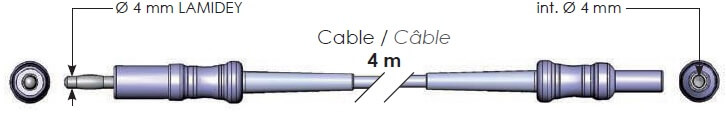
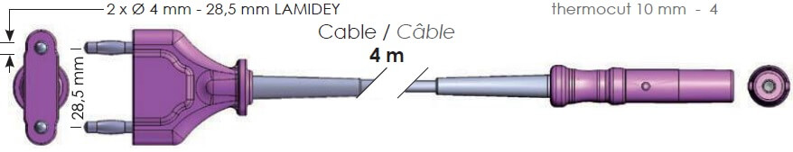
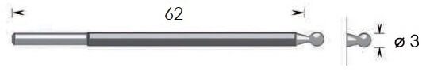
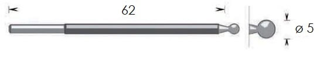
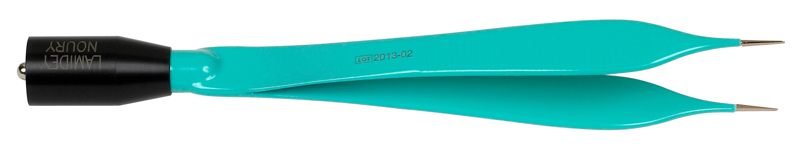
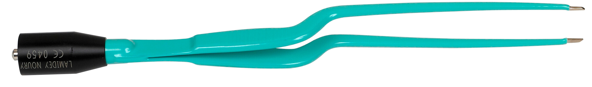
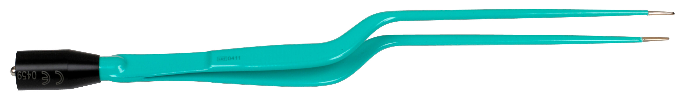
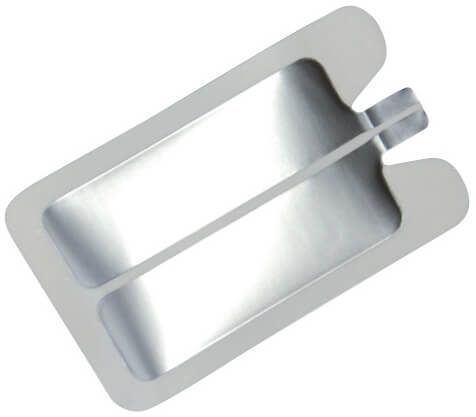

# Lamidey-Noury-images
Bienvenue dans le référentiel d'images Lamidey-Noury, mettant en vedette une variété d'outils médicaux de haute qualité. Explorez les différentes catégories ci-dessous pour découvrir les produits disponibles.

## Table des Matières
- [Adaptateurs](#adaptateurs)
- [Argons](#argons)
- [Câbles](#câbles)
- [Electrodes de Résection](#electrodes-de-résection)
- [Guéridon](#guéridon)
- [Manches](#manches)
- [Pédales](#pédales)
- [Pinces Monopolaires](#pinces-monopolaires)
- [Pinces Bipolaires](#pinces-bipolaires)
- [Plaques](#plaques)
- [Thermoclamp](#thermoclamp)
- [Thermocut](#thermocut)

## Adaptateurs

1.  - Adaptateur V11KA88
2.  - Adaptateur V11KA89
3.  - Adaptateur V11KA91
4.  - Adaptateur V11KA92
5.  - Adaptateur V11KA94
6.  - Adaptateur V11KA98

## Argons

1.  - Argon V11A201
2.  - Argon V11A301 bis
3.  - Argon V11A301
4.  - Argon V11A302 bis
5.  - Argon V11A302
6.  - Argon V11A303 bis
7.  - Argon V11A303
8.  - Argon V11A312
9.  - Argon V11A313 bis
10.  - Argon V11A313
11.  - Argon V11A400
12.  - Argon V11A401
13.  - Argon V11A402
14.  - Argon V11A403

## Câbles

1.  - Câble V11F242-242TC
2.  - Câble V11F242
3.  - Câble V11F242C
4.  - Câble V11F242E
5.  - Câble V11F242TC
6.  - Câble V11F342
7.  - Câble V11F343
8.  - Câble V11F345
9.  - Câble V11F3AX bis
10.  - Câble V11F3AX
11.  - Câble V11FM40
12.  - Câble V11FM40P
13.  - Câble V11FM43
14.  - Câble V11FM44
15.  - Câble V12PBS25DM
16.  - Câble V12PBS25S
17.  - Câble V12PBS26D
18.  - Câble V12PBS26DM
19.  - Câble V12PBS26M
20.  - Câble V12PBS26S

## Electrodes de résection

1.  - Electrode VRU01
2.  - Electrode VRU011
3.  - Electrode VRU11
4.  - Electrode VRU21
5.  - Electrode VRU31
6.  - Electrode VRU41
7.  - Electrode VRUB1
8.  - Electrode VRUN1
9.  - Electrode VRUV1
10.  - Electrode V11A52C
11.  - Electrode V11A52L
12.  - Electrode V11A52M
13.  - Electrode V11A82C
14.  - Electrode V11A82L
15.  - Electrode V11A82M
16.  - Electrode V11B32L
17.  - Electrode V11B32M
18.  - Electrode V11B3CI
19.  - Electrode V11B42L
20.  - Electrode V11B42M
21.  - Electrode V11B4CI
22.  - Electrode V11B52L
23.  - Electrode V11B52M
24.  - Electrode V11B5CI
25.  - Electrode V11B82L
26.  - Electrode V11B82M
27.  - Electrode V11B8CI
28.  - Electrode V11CC2L
29.  - Electrode V11CC2M
30.  - Electrode V11CCCI
31.  - Electrode V11CCDI
32.  - Electrode V11CCDTC
33.  - Electrode V11CCDTC
34.  - Electrode V11CCDX
35.  - Electrode V11CD2L

## Guéridon

1.  - Guéridon V10GALP

## Manches

1. 
2. 
3. 
4. 
5. 
6. 
7. 
8. 
9. 
10. 
11. 

## Pédales

1.  - Pédale V11SM1DN
2.  - Pédale V11SM2FN

## Pinces Monopolaires

1. 
2. 
3. 
4. 
5. 
6. 
7. 
8. 
9. 
10. 
11. 
12. 
13. 
14. 
15. 
16. 
17. 
18. 
19. 
20. 
21. 
22. 

## Pinces Bipolaires

1. 
2. 
3. 
4. 
5. 
6. 
7. 
8. 
9. 
10. 
11. 
12. 
13. 
14. 
15. 
16. 
17. 
18. 
19. 
20. 
21. 
22. 
23. 
24. 
25. 
26. 
27. 
28. 
29. 
30. 
31. 
32. 
33. 
34. 
35. 

## Plaques

1.  - Plaque VPLEN2
2.  - Plaque VPLAD2

## Thermoclamp

1. 
2. 
3. 
4. 
5. 
6. 

## Thermocut

1. 
2. 
3. 
4. 
5. 
6. 
7. 
8. 
9. 
10. 
11. 
12. 
13. 
14. 
15. 
16. 
17. 
18. 
19. 
20. 
21. 
22. 
23.  - Lame VSU9000

24. ## Liens vers la documentation
Consultez la documentation complète sur l'utilisation de ces éléments dans le cadre d'un projet plus vaste [ici](https://example.com/documentation).

## Optimisation des images
Les images incluses dans ce référentiel sont optimisées pour une taille de fichier réduite, garantissant des temps de chargement efficaces.

## Crédits
Nous remercions les contributeurs suivants pour leur précieuse contribution à ce projet :
- [Nom du contributeur 1](https://github.com/contributeur1)
- [Nom du contributeur 2](https://github.com/contributeur2)

## Exemples d'utilisation
Découvrez des exemples d'utilisation de ces ressources dans le contexte de projets réels dans le dossier [Exemples](Exemples/).

## Mises à jour
Consultez la section [CHANGELOG.md](CHANGELOG.md) pour les dernières mises à jour et modifications apportées au projet.

## Support
Besoin d'aide ou avez-vous trouvé un problème ? Soumettez une demande d'assistance sur notre [page de support](https://example.com/support) ou signalez un problème sur la [page des problèmes](https://github.com/votre-utilisateur/votre-projet/issues).

## Liens vers des ressources externes
- [Projet externe 1](https://projetexterne1.com)
- [Projet externe 2](https://projetexterne2.com)
