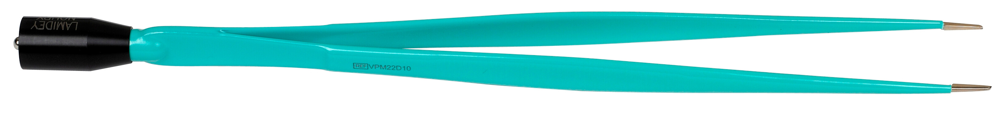
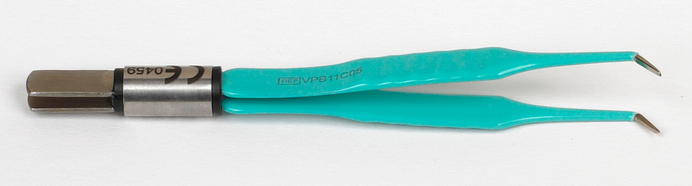
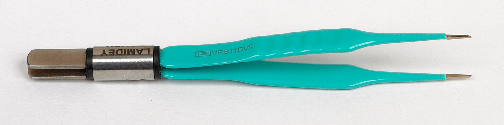

<<<<<<< HEAD
# [Minimal Mistakes Jekyll theme](https://mmistakes.github.io/minimal-mistakes/)

[](https://raw.githubusercontent.com/mmistakes/minimal-mistakes/master/LICENSE)
[](https://jekyllrb.com/)
[](https://rubygems.org/gems/minimal-mistakes-jekyll)
[](https://www.paypal.me/mmistakes)
[](https://www.buymeacoffee.com/mmistakes)

Minimal Mistakes is a flexible two-column Jekyll theme, perfect for building personal sites, blogs, and portfolios. As the name implies, styling is purposely minimalistic to be enhanced and customized by you :smile:.

:sparkles: See what's new in the [CHANGELOG](CHANGELOG.md).

**If you enjoy this theme, please consider sponsoring:**

[](https://www.buymeacoffee.com/mmistakes)
 [](https://www.paypal.me/mmistakes)

**Note:** The theme uses the [jekyll-include-cache](https://github.com/benbalter/jekyll-include-cache) plugin which will need to be installed in your `Gemfile` and must be retained in the `plugins` array of `_config.yml`. Otherwise you'll encounter `Unknown tag 'include_cached'` errors at build.

[![Minimal Mistakes live preview][2]][1]

[1]: https://mmistakes.github.io/minimal-mistakes/
[2]: screenshot.png (live preview)


## Notable features

- Bundled as a "theme gem" for easier installation/upgrading.
- Compatible with GitHub Pages.
- Support for Jekyll's built-in Sass/SCSS preprocessor.
- Nine different skins (color variations).
- Several responsive layout options (single, archive index, search, splash, and paginated home page).
- Optimized for search engines with support for [Twitter Cards](https://dev.twitter.com/cards/overview) and [Open Graph](http://ogp.me/) data.
- Optional [header images](https://mmistakes.github.io/minimal-mistakes/docs/layouts/#headers), [custom sidebars](https://mmistakes.github.io/minimal-mistakes/docs/layouts/#sidebars), [table of contents](https://mmistakes.github.io/minimal-mistakes/docs/helpers/#table-of-contents), [galleries](https://mmistakes.github.io/minimal-mistakes/docs/helpers/#gallery), related posts, [breadcrumb links](https://mmistakes.github.io/minimal-mistakes/docs/configuration/#breadcrumb-navigation-beta), [navigation lists](https://mmistakes.github.io/minimal-mistakes/docs/helpers/#navigation-list), and more.
- Commenting support (powered by [Disqus](https://disqus.com/), [Facebook](https://developers.facebook.com/docs/plugins/comments), Google+, [Discourse](https://www.discourse.org/), static-based via [Staticman](https://staticman.net/), [utterances](https://utteranc.es/), and [giscus](https://giscus.app/)).
- [Google Analytics](https://www.google.com/analytics/) support.
- UI localized text in English (default), Arabic (عربي), Brazilian Portuguese (Português brasileiro), Catalan, Chinese, Danish, Dutch, Finnish, French (Français), German (Deutsch), Greek, Hebrew, Hindi (हिंदी), Hungarian, Indonesian, Irish (Gaeilge), Italian (Italiano), Japanese, Kiswahili, Korean, Malayalam, Myanmar (Burmese), Nepali (Nepalese), Norwegian (Norsk), Persian (فارسی), Polish, Punjabi (ਪੰਜਾਬੀ), Romanian, Russian, Slovak, Spanish (Español), Swedish, Thai, Turkish (Türkçe), and Vietnamese.

## Skins (color variations)

This theme comes in nine different skins (in addition to the default one).

| `air` | `contrast` | `dark` |
| --- | --- | --- |
| [](https://mmistakes.github.io/minimal-mistakes/assets/images/air-skin-archive-large.png) | [](https://mmistakes.github.io/minimal-mistakes/assets/images/contrast-skin-archive-large.png) | [](https://mmistakes.github.io/minimal-mistakes/assets/images/dark-skin-archive-large.png) |

| `dirt` | `mint` | `sunrise` |
| --- | --- | --- |
| [](https://mmistakes.github.io/minimal-mistakes/assets/images/dirt-skin-archive-large.png) | [](https://mmistakes.github.io/minimal-mistakes/assets/images/mint-skin-archive-large.png) | [](https://mmistakes.github.io/minimal-mistakes/assets/images/sunrise-skin-archive-large.png) |

| `aqua` | `neon` | `plum` |
| --- | --- | --- |
| [](https://mmistakes.github.io/minimal-mistakes/assets/images/aqua-skin-archive-large.png) | [](https://mmistakes.github.io/minimal-mistakes/assets/images/neon-skin-archive-large.png) | [](https://mmistakes.github.io/minimal-mistakes/assets/images/plum-skin-archive-large.png) |

## Demo pages

| Name                                        | Description                                           |
| ------------------------------------------- | ----------------------------------------------------- |
| [Post with Header Image][header-image-post] | A post with a large header image. |
| [HTML Tags and Formatting Post][html-tags-post] | A variety of common markup showing how the theme styles them. |
| [Syntax Highlighting Post][syntax-post] | Post displaying highlighted code. |
| [Post with a Gallery][gallery-post] | A post showing several images wrapped in `<figure>` elements. |
| [Sample Collection Page][sample-collection] | Single page from a collection. |
| [Categories Archive][categories-archive] | Posts grouped by category. |
| [Tags Archive][tags-archive] | Posts grouped by tag. |

Additional sample posts are available under [posts archive][year-archive] on the demo site. Source files for these (and the entire demo site) can be found in [`/docs`](docs).

[header-image-post]: https://mmistakes.github.io/minimal-mistakes/layout-header-image-text-readability/
[gallery-post]: https://mmistakes.github.io/minimal-mistakes/post%20formats/post-gallery/
[html-tags-post]: https://mmistakes.github.io/minimal-mistakes/markup/markup-html-tags-and-formatting/
[syntax-post]: https://mmistakes.github.io/minimal-mistakes/markup-syntax-highlighting/
[sample-collection]: https://mmistakes.github.io/minimal-mistakes/recipes/chocolate-chip-cookies/
[categories-archive]: https://mmistakes.github.io/minimal-mistakes/categories/
[tags-archive]: https://mmistakes.github.io/minimal-mistakes/tags/
[year-archive]: https://mmistakes.github.io/minimal-mistakes/year-archive/

## Installation

There are three ways to install: as a [gem-based theme](https://jekyllrb.com/docs/themes/#understanding-gem-based-themes), as a [remote theme](https://blog.github.com/2017-11-29-use-any-theme-with-github-pages/) (GitHub Pages compatible), or forking/directly copying all of the theme files into your project.

### Gem-based method

With Gem-based themes, directories such as the `assets`, `_layouts`, `_includes`, and `_sass` are stored in the theme’s gem, hidden from your immediate view. Yet all of the necessary directories will be read and processed during Jekyll’s build process.

This allows for easier installation and updating as you don't have to manage any of the theme files. To install:

1. Add the following to your `Gemfile`:

   ```ruby
   gem "minimal-mistakes-jekyll"
   ```

2. Fetch and update bundled gems by running the following [Bundler](http://bundler.io/) command:

   ```bash
   bundle
   ```

3. Set the `theme` in your project's Jekyll `_config.yml` file:

   ```yaml
   theme: minimal-mistakes-jekyll
   ```

To update the theme run `bundle update`.

### Remote theme method

Remote themes are similar to Gem-based themes, but do not require `Gemfile` changes or whitelisting making them ideal for sites hosted with GitHub Pages.

To install:

1. Create/replace the contents of your `Gemfile` with the following:

   ```ruby
   source "https://rubygems.org"

   gem "github-pages", group: :jekyll_plugins
   gem "jekyll-include-cache", group: :jekyll_plugins
   ```

2. Add `jekyll-include-cache` to the `plugins` array of your `_config.yml`.

3. Fetch and update bundled gems by running the following [Bundler](http://bundler.io/) command:

   ```bash
   bundle
   ```

4. Add `remote_theme: "mmistakes/minimal-mistakes@4.24.0"` to your `_config.yml` file. Remove any other `theme:` or `remote_theme:` entry.

**Looking for an example?** Use the [Minimal Mistakes remote theme starter](https://github.com/mmistakes/mm-github-pages-starter/generate) for the quickest method of getting a GitHub Pages hosted site up and running. Generate a new repository from the starter, replace sample content with your own, and configure as needed.

## Usage

For detailed instructions on how to configure, customize, add/migrate content, and more read the [theme's documentation](https://mmistakes.github.io/minimal-mistakes/docs/quick-start-guide/).

---

## Contributing

Found a typo in the documentation or interested in [fixing a bug](https://github.com/mmistakes/minimal-mistakes/issues)? Then by all means [submit an issue](https://github.com/mmistakes/minimal-mistakes/issues/new) or [pull request](https://help.github.com/articles/using-pull-requests/). If this is your first pull request, it may be helpful to read up on the [GitHub Flow](https://guides.github.com/introduction/flow/) first.

For help with using the theme or general Jekyll support questions, please use the [Jekyll Talk forums](https://talk.jekyllrb.com/).

### Pull Requests

When submitting a pull request:

1. Clone the repo.
2. Create a branch off of `master` and give it a meaningful name (e.g. `my-awesome-new-feature`).
3. Open a pull request on GitHub and describe the feature or fix.

Theme documentation and demo pages can be found in the [`/docs`](docs) if submitting improvements, typo corrections, etc.

## Development

To set up your environment to develop this theme, run `bundle install`.

To test the theme, run `bundle exec rake preview` and open your browser at `http://localhost:4000/test/`. This starts a Jekyll server using content in the `test/` directory. As modifications are made to the theme and test site, it will regenerate and you should see the changes in the browser after a refresh.

---

## Credits

### Creator

**Michael Rose**

- <https://mademistakes.com>
- <https://twitter.com/mmistakes>
- <https://github.com/mmistakes>

### Icons + Demo Images:

- [The Noun Project](https://thenounproject.com) -- Garrett Knoll, Arthur Shlain, and [tracy tam](https://thenounproject.com/tracytam)
- [Font Awesome](http://fontawesome.io/)
- [Unsplash](https://unsplash.com/)

### Other:

- [Jekyll](http://jekyllrb.com/)
- [jQuery](http://jquery.com/)
- [Susy](http://susy.oddbird.net/)
- [Breakpoint](http://breakpoint-sass.com/)
- [Magnific Popup](http://dimsemenov.com/plugins/magnific-popup/)
- [FitVids.JS](http://fitvidsjs.com/)
- [GreedyNav.js](https://github.com/lukejacksonn/GreedyNav)
- [Smooth Scroll](https://github.com/cferdinandi/smooth-scroll)
- [Gumshoe](https://github.com/cferdinandi/gumshoe)
- [jQuery throttle / debounce](http://benalman.com/projects/jquery-throttle-debounce-plugin/)
- [Lunr](http://lunrjs.com)

---

## License

The MIT License (MIT)

Copyright (c) 2013-2020 Michael Rose and contributors

Permission is hereby granted, free of charge, to any person obtaining a copy
of this software and associated documentation files (the "Software"), to deal
in the Software without restriction, including without limitation the rights
to use, copy, modify, merge, publish, distribute, sublicense, and/or sell
copies of the Software, and to permit persons to whom the Software is
furnished to do so, subject to the following conditions:

The above copyright notice and this permission notice shall be included in all
copies or substantial portions of the Software.

THE SOFTWARE IS PROVIDED "AS IS", WITHOUT WARRANTY OF ANY KIND, EXPRESS OR
IMPLIED, INCLUDING BUT NOT LIMITED TO THE WARRANTIES OF MERCHANTABILITY,
FITNESS FOR A PARTICULAR PURPOSE AND NONINFRINGEMENT. IN NO EVENT SHALL THE
AUTHORS OR COPYRIGHT HOLDERS BE LIABLE FOR ANY CLAIM, DAMAGES OR OTHER
LIABILITY, WHETHER IN AN ACTION OF CONTRACT, TORT OR OTHERWISE, ARISING FROM,
OUT OF OR IN CONNECTION WITH THE SOFTWARE OR THE USE OR OTHER DEALINGS IN THE
SOFTWARE.

Minimal Mistakes incorporates icons from [The Noun Project](https://thenounproject.com/) 
creators Garrett Knoll, Arthur Shlain, and tracy tam.
Icons are distributed under Creative Commons Attribution 3.0 United States (CC BY 3.0 US).

Minimal Mistakes incorporates [Font Awesome](http://fontawesome.io/),
Copyright (c) 2017 Dave Gandy.
Font Awesome is distributed under the terms of the [SIL OFL 1.1](http://scripts.sil.org/OFL) 
and [MIT License](http://opensource.org/licenses/MIT).

Minimal Mistakes incorporates photographs from [Unsplash](https://unsplash.com).

Minimal Mistakes incorporates [Susy](http://susy.oddbird.net/),
Copyright (c) 2017, Miriam Eric Suzanne.
Susy is distributed under the terms of the [BSD 3-clause "New" or "Revised" License](https://opensource.org/licenses/BSD-3-Clause).

Minimal Mistakes incorporates [Breakpoint](http://breakpoint-sass.com/).
Breakpoint is distributed under the terms of the [MIT/GPL Licenses](http://opensource.org/licenses/MIT).

Minimal Mistakes incorporates [FitVids.js](https://github.com/davatron5000/FitVids.js/),
Copyright (c) 2013 Dave Rubert and Chris Coyier.
FitVids is distributed under the terms of the [WTFPL License](http://www.wtfpl.net/).

Minimal Mistakes incorporates [Magnific Popup](http://dimsemenov.com/plugins/magnific-popup/),
Copyright (c) 2014-2016 Dmitry Semenov, http://dimsemenov.com.
Magnific Popup is distributed under the terms of the MIT License.

Minimal Mistakes incorporates [Smooth Scroll](http://github.com/cferdinandi/smooth-scroll),
Copyright (c) 2019 Chris Ferdinandi.
Smooth Scroll is distributed under the terms of the [MIT License](http://opensource.org/licenses/MIT).

Minimal Mistakes incorporates [Gumshoejs](http://github.com/cferdinandi/gumshoe),
Copyright (c) 2019 Chris Ferdinandi.
Gumshoejs is distributed under the terms of the [MIT License](http://opensource.org/licenses/MIT).

Minimal Mistakes incorporates [jQuery throttle / debounce](http://benalman.com/projects/jquery-throttle-debounce-plugin/),
Copyright (c) 2010 "Cowboy" Ben Alman.
jQuery throttle / debounce is distributed under the terms of the [MIT License](http://opensource.org/licenses/MIT).

Minimal Mistakes incorporates [GreedyNav.js](https://github.com/lukejacksonn/GreedyNav),
Copyright (c) 2015 Luke Jackson.
GreedyNav.js is distributed under the terms of the [MIT License](http://opensource.org/licenses/MIT).

Minimal Mistakes incorporates [Jekyll Group-By-Array](https://github.com/mushishi78/jekyll-group-by-array),
Copyright (c) 2015 Max White <mushishi78@gmail.com>.
Jekyll Group-By-Array is distributed under the terms of the [MIT License](http://opensource.org/licenses/MIT).

Minimal Mistakes incorporates [@allejo's Pure Liquid Jekyll Table of Contents](https://allejo.io/blog/a-jekyll-toc-in-liquid-only/),
Copyright (c) 2017 Vladimir Jimenez.
Pure Liquid Jekyll Table of Contents is distributed under the terms of the [MIT License](http://opensource.org/licenses/MIT).

Minimal Mistakes incorporates [Lunr](http://lunrjs.com),
Copyright (c) 2018 Oliver Nightingale.
Lunr is distributed under the terms of the [MIT License](http://opensource.org/licenses/MIT).
=======

**<span style="color:blue;">Bienvenue dans le référentiel d'images Lamidey Noury Medical, mettant en vedette une variété d'outils médicaux de haute qualité. Explorez les différentes catégories ci-dessous pour découvrir les produits disponibles.</span>**


## Table des Matières
<details>
  <summary>Cliquez pour afficher</summary>

- [Adaptateurs](#adaptateurs)
- [Argons](#argons)
- [Câbles](#câbles)
- [Electrodes de Résection](#electrodes-de-résection)
- [Guéridon](#guéridon)
- [Manches](#manches)
- [Pédales](#pédales)
- [Pinces Monopolaires](#pinces-monopolaires)
- [Pinces Bipolaires](#pinces-bipolaires)
- [Plaques](#plaques)
- [Thermoclamp](#thermoclamp)
- [Thermocut](#thermocut)

</details>


## Adaptateurs
***Adaptateurs polyvalents pour différentes applications.***

- **<span class="blue-text">Adaptateur V11KA88</span>**
   
   
   
- **<span class="blue-text">Adaptateur V11KA89</span>**
   
   
   
- **<span class="blue-text">Adaptateur V11KA91</span>**
   
   
   
- **<span class="blue-text">Adaptateur V11KA92</span>**
   
   
   
- **<span class="blue-text">Adaptateur V11KA94</span>**
    
   
   
- **<span class="blue-text">Adaptateur V11KA98</span>**
    
   


## Argons
***Conçu pour une administration efficace d'argon médical.***

- **<span class="blue-text">Argon V11A201</span>**
   
   

- **<span class="blue-text">Argon V11A301</span>**
   
   

- **<span class="blue-text">Argon V11A302</span>**
   
   

- **<span class="blue-text">Argon V11A303</span>**
   
   

- **<span class="blue-text">Argon V11A312</span>**
   
   

- **<span class="blue-text">Argon V11A313</span>**
   
   

- **<span class="blue-text">Argon V11A400</span>**
   
   

- **<span class="blue-text">Argon V11A401</span>**
   
   

- **<span class="blue-text">Argon V11A402</span>**
   
   

- **<span class="blue-text">Argon V11A403</span>**
    
   


## Câbles
***Câbles dotés de connecteurs de qualité pour une transmission optimale.***

- **<span class="blue-text">Câble V11F242-242TC</span>**
   
   

- **<span class="blue-text">Câble V11F242</span>**
   
   

- **<span class="blue-text">Câble V11F242C</span>**
   
   

- **<span class="blue-text">Câble V11F242E</span>**
   
   

- **<span class="blue-text">Câble V11F242TC</span>**
    
   

- **<span class="blue-text">Câble V11F342</span>**
    
   

- **<span class="blue-text">Câble V11F343</span>**
    
   

- **<span class="blue-text">Câble V11F345</span>**
    
   

- **<span class="blue-text">Câble V11F3AX</span>**
   
   

- **<span class="blue-text">Câble V11FM40</span>**
    
   

- **<span class="blue-text">Câble V11FM40P</span>**
    
   

- **<span class="blue-text">Câble V11FM43</span>**
    
   

- **<span class="blue-text">Câble V11FM44</span>**
    
   

- **<span class="blue-text">Câble V12PBS25DM</span>**
    
   

- **<span class="blue-text">Câble V12PBS25S</span>**
    
   

- **<span class="blue-text">Câble V12PBS26D</span>**
    
   

- **<span class="blue-text">Câble V12PBS26DM</span>**
    
   

- **<span class="blue-text">Câble V12PBS26M</span>**
    
   

- **<span class="blue-text">Câble V12PBS26S</span>**
    
   


## Electrodes de Résection
***Performance fiable pour une résection précise.***

- **<span class="blue-text">Électrode VRU01</span>**
   
   

- **<span class="blue-text">Électrode VRU011</span>**
   
   

- **<span class="blue-text">Électrode VRU11</span>**
   
   

- **<span class="blue-text">Électrode VRU21</span>**
   
   

- **<span class="blue-text">Électrode VRU31</span>**
    
   

- **<span class="blue-text">Électrode VRU41</span>**
    
   

- **<span class="blue-text">Électrode VRUB1</span>**
    
   

- **<span class="blue-text">Électrode VRUN1</span>**
    
   

- **<span class="blue-text">Électrode VRUV1</span>**
    
   


## Electrodes Monopolaires 
### Anses
- **<span class="blue-text">Électrode V11A52C</span>**
   
   

- **<span class="blue-text">Électrode V11A52L</span>**
   
   

- **<span class="blue-text">Électrode V11A52M</span>**
   
   

- **<span class="blue-text">Électrode V11A82C</span>**
   
   

- **<span class="blue-text">Électrode V11A82L</span>**
   
   

- **<span class="blue-text">Électrode V11A82M</span>**
   
   

### Boules
- **<span class="blue-text">Électrode V11B32L</span>**
   
   

- **<span class="blue-text">Électrode V11B32M</span>**
   
   

- **<span class="blue-text">Électrode V11B3CI</span>**
    
   

- **<span class="blue-text">Électrode V11B42L</span>**
    
   

- **<span class="blue-text">Électrode V11B42M</span>**

   

- **<span class="blue-text">Électrode V11B4CI</span>**

   

### Couteaux

- **<span class="blue-text">Électrode V11CC2L</span>**

   

- **<span class="blue-text">Électrode V11CC2M</span>**

   

- **<span class="blue-text">Électrode V11CCCI</span>**

   

- **<span class="blue-text">Électrode V11CCDI</span>**

   

- **<span class="blue-text">Électrode V11CCDTC</span>**

   

- **<span class="blue-text">Électrode V11CCDTC</span>**

   

- **<span class="blue-text">Électrode V11CCDX</span>**

   

- **<span class="blue-text">Électrode V11CD2L</span>**

   

### Conisation

- **<span class="blue-text">Électrode V11GCT2</span>**

   

- **<span class="blue-text">Électrode V11GCT3</span>**

   

- **<span class="blue-text">Électrode V11GCT4</span>**

   

- **<span class="blue-text">Électrode V11GCT21</span>**

   

- **<span class="blue-text">Électrode V11GCT22</span>**

   

- **<span class="blue-text">Électrode V11GCT31</span>**

   

- **<span class="blue-text">Électrode V11GCT32</span>**

   

- **<span class="blue-text">Électrode V11GCT41</span>**

   

- **<span class="blue-text">Électrode V11GCT42</span>**

   

### UU

- **<span class="blue-text">Électrode VEUC1</span>**

   

- **<span class="blue-text">Électrode VEUC2-VEUCL2</span>**

   

- **<span class="blue-text">Électrode VEUCL1</span>**

   

- **<span class="blue-text">Électrode VEUCL2</span>**

   

- **<span class="blue-text">Électrode VEUT1</span>**

   

## Guéridon

***Le guéridon V10GALP est un équipement médical essentiel, offrant une surface stable et pratique pour le positionnement d'instruments et de fournitures médicales pendant les procédures.***

- **<span class="blue-text">Guéridon V10GALP</span>**

   

## Manches

***Découvrez notre gamme de manches ergonomiques conçus pour une utilisation confortable et précise lors d'interventions médicales.***

- **<span class="blue-text">Manche VSUC1</span>**

   

- **<span class="blue-text">Manche VSUC15</span>**

   

- **<span class="blue-text">Manche VSUC2</span>**

   

- **<span class="blue-text">Manche VSUCL1</span>**

   

- **<span class="blue-text">Manche VSUEC1</span>**

   
   
- **Manche VSUT1**
  
  

- **Manche VSUT2**
  
  

- **Manche V11MCT14**
  
  

- **Manche V11MCT9N**
  
  

## Pédales

***Les pédales V11SM1DN et V11SM2FN offrent un contrôle précis et réactif, facilitant l'activation d'instruments médicaux compatibles.***

- **Pédale V11SM1DN**
  
  

- **Pédale V11SM2FN**
  
  

## Pinces Monopolaires

***Découvrez notre sélection de pinces monopolaires offrant des performances fiables pour les procédures médicales.***

- **Pince Monopolaire VPM11D03**
  
  

- **Pince Monopolaire VPM13C10**
  
  

- **Pince Monopolaire VPM13D08G**
  
  

- **Pince Monopolaire VPM13D10**
  
  

- **Pince Monopolaire VPM13D12G**
  
  

- **Pince Monopolaire VPM16B10**
  
  

- **Pince Monopolaire VPM16C10**
  
  

- **Pince Monopolaire VPM16D08G**
  
  

- **Pince Monopolaire VPM16D10**
  
  

- **Pince Monopolaire VPM16D12G**
  
  

- **Pince Monopolaire VPM20B10**
  
  

- **Pince Monopolaire VPM20D08G**
  
  

- **Pince Monopolaire VPM20D10**
  
  

- **Pince Monopolaire VPM20D12G**
  
  

- **Pince Monopolaire VPM22C10**
  
  

- **Pince Monopolaire VPM22C20**
  
  

- **Pince Monopolaire VPM22D10**
  
  

- **Pince Monopolaire VPM22D25**
  
  

- **Pince Monopolaire VPMC20C10**
  
  

- **Pince Monopolaire VPMS16D10**
  
  

- **Pince Monopolaire VPMS20D10**
  
  

## Pinces Bipolaires

***Découvrez notre gamme de pinces bipolaires, conçues pour assurer une coagulation efficace avec une précision optimale.***

- **<span class="blue-text">Pince Bipolaire VPB11C05</span>**
  
  

- **<span class="blue-text">Pince Bipolaire VPB11D03</span>**
  
  

- **<span class="blue-text">Pince Bipolaire VPB11D05</span>**
  
  

- **<span class="blue-text">Pince Bipolaire VPB11D10</span>**
  
  

- **<span class="blue-text">Pince Bipolaire VPB13C03</span>**
  
  

- **<span class="blue-text">Pince Bipolaire VPB13D05</span>**
  
  

- **<span class="blue-text">Pince Bipolaire VPB16B05</span>**
  
  

- **<span class="blue-text">Pince Bipolaire VPB16B10</span>**
  
  

- **<span class="blue-text">Pince Bipolaire VPB16C10</span>**
  
  

- **<span class="blue-text">Pince Bipolaire VPB16D03</span>**
  
  

- **<span class="blue-text">Pince Bipolaire VPB18C05</span>**
  
  

- **<span class="blue-text">Pince Bipolaire VPB18C10</span>**
  
  

- **<span class="blue-text">Pince Bipolaire VPB18D03</span>**
  
  

- **<span class="blue-text">Pince Bipolaire VPB18D10</span>**
  
  

- **<span class="blue-text">Pince Bipolaire VPB18D20</span>**
  
  

- **<span class="blue-text">Pince Bipolaire VPB20AR10</span>**
  
  

- **<span class="blue-text">Pince Bipolaire VPB20AV10</span>**
  
  

- **<span class="blue-text">Pince Bipolaire VPB20B03</span>**
  
  

- **<span class="blue-text">Pince Bipolaire VPB20B20</span>**
  
  

- **<span class="blue-text">Pince Bipolaire VPB20C10</span>**
  
  

- **<span class="blue-text">Pince Bipolaire VPB20C20</span>**
  
  

- **<span class="blue-text">Pince Bipolaire VPB20D03</span>**
  
  

- **<span class="blue-text">Pince Bipolaire VPB20D10</span>**
  
  

- **<span class="blue-text">Pince Bipolaire VPB20D20</span>**
  
  

- **<span class="blue-text">Pince Bipolaire VPB22B03</span>**
  
  

- **<span class="blue-text">Pince Bipolaire VPB22B10</span>**
  
  

- **<span class="blue-text">Pince Bipolaire VPB22C10</span>**
  
  

- **<span class="blue-text">Pince Bipolaire VPB22C20</span>**
  
  

- **<span class="blue-text">Pince Bipolaire VPB22D10</span>**
  
  

- **<span class="blue-text">Pince Bipolaire VPB22D20</span>**
  
  

- **<span class="blue-text">Pince Bipolaire VPB25B05-bis</span>**
  
  

- **<span class="blue-text">Pince Bipolaire VPB25B05</span>**
  
  

- **<span class="blue-text">Pince Bipolaire VPB25D10</span>**
  
  

## Plaques

***Nos plaques offrent une interface sûre et fiable pour les procédures électrochirurgicales, assurant une dispersion efficace du courant électrique.***

- **<span class="blue-text">Plaque VPLEN2</span>**
  
  

- **<span class="blue-text">Plaque VPLAD2</span>**
  
  

- **<span class="blue-text">Plaque V11IS1C</span>**
  
  

- **<span class="blue-text">Connecteur V11K250</span>**
  
  

## Thermoclamp

   ***Les thermoclamps offrent un contrôle thermique précis lors des interventions chirurgicales, assurant la sécurité du patient et du personnel médical.***

- **<span class="blue-text">Thermoclamp V11CLPBS2</span>**
  
  

- **<span class="blue-text">Thermoclamp V11CLPBS4</span>**
  
  

- **<span class="blue-text">Thermoclamp V11CLPBS6</span>**
  
  

- **<span class="blue-text">Thermoclamp V11CLPBS62</span>**
  
  

## Thermocut

***Le Thermocut est conçu pour fournir des résultats fiables et une coagulation efficace, assurant la sécurité du patient et du personnel médical.***

- **<span class="blue-text">Thermocut V12PBN211</span>**
  
  

- **<span class="blue-text">Thermocut V12PBN21P</span>**
  
  

- **<span class="blue-text">Thermocut V12PBN21R</span>**
  
  

- **<span class="blue-text">Thermocut V12PBN221</span>**
  
  

- **<span class="blue-text">Thermocut V12PBN22P</span>**
  
  

- **<span class="blue-text">Thermocut V12PBN22R</span>**
  
  

- **<span class="blue-text">Thermocut V12PBN2S</span>**
  
  

- **<span class="blue-text">Thermocut V12PBN52</span>**
  
  

- **<span class="blue-text">Thermocut V12PBN521R</span>**
  
  

- **<span class="blue-text">Thermocut V12PBN522R</span>**
  
  

- **<span class="blue-text">Thermocut V12PBN523</span>**
  
  

- **<span class="blue-text">Thermocut V12PBN5230</span>**
  
  

- **<span class="blue-text">Thermocut V12PBN524</span>**
  
  

- **<span class="blue-text">Thermocut V12PBN5240</span>**
  
  

- **<span class="blue-text">Thermocut V12PBS210</span>**
  
  

- **<span class="blue-text">Thermocut V12PBS220</span>**
  
  

- **<span class="blue-text">Thermocut V12PBS25DM</span>**
  
  

- **<span class="blue-text">Thermocut V12PBS25S</span>**
  
  

- **<span class="blue-text">Thermocut V12PBS26D</span>**
  
  

- **<span class="blue-text">Thermocut V12PBS26DM</span>**
  
  

- **<span class="blue-text">Thermocut V12PBS26M</span>**
  
  

- **<span class="blue-text">Thermocut V12PBS26S</span>**
  
  


## Fiches technique

<details>
  <summary>Cliquez pour afficher</summary>

### Adaptateurs
- [Adaptateurs](FT-Adaptateurs-210521_FR.pdf)

### Argons
- [Argons](FT-module_Argon-0822-FR.pdf)

### Câbles
- [Câbles](FT-Cables-210521_FR.pdf)

### Electrodes de Résection
- [Electrodes de Résection](FT-Electrode_gyneco_conisation-221006_FR.pdf)
- [Electrodes de Résection](FT-Electrode_aiguille_FR-200827.pdf)
- [Electrodes de Résection](FT-Electrode_anses_FR-200827.pdf)
- [Electrodes de Résection](FT-Electrode_boules_FR-201007.pdf)
- [Electrodes de Résection](FT-Electrode_couteaux_FR-201007.pdf)

### Anses
- [Anses](FT-anse_FRONT_LOAD_FR-220623.pdf)
- [Anses](FT-anse_Gynecare_FR-210812.pdf)
- [Anses](FT-anse_Reutilisable_FR-210812.pdf)
- [Anses](FT-anse_SIDE_LOAD_FR-220210.pdf)
- [Anses](FT-anse_Universelle_FR-220210.pdf)

### Manches
- [Manches](FT-manche_Derlec_FR-200720.pdf)
- [Manches](FT-manche_Tactilec_FR-200720.pdf)

### Pédales
- [Pédales](FT-Pédales_04_2019.pdf)

### Pinces Monopolaires
- [Pinces Monopolaires](Pinces_monopolaires_FT_0105_FR.pdf)

### Pinces Bipolaires
- [Pinces Bipolaires](FT-Pince_bipolaire_coudee-210129-FR.pdf)
- [Pinces Bipolaires](FT-Pince_bipolaire_droite-210129-FR.pdf)
- [Pinces Bipolaires](FT-Pinces_bipol_baionnettes-200828-FR.pdf)

### Plaques
- [Plaques](FT_Lames_Thermocut_FR.pdf)
- [Plaques](Thermocut5_FT_0722-FR.pdf)
- [Plaques](Thermocut10_FT-0722-FR.pdf)

### Thermoclamp
- [Thermoclamp](Pince_thermoclamp_et_Thermocision-FT_211116-FR.pdf)

### Thermocut
- [Thermocut](FT-Set_V11ELDI_FR-210202.pdf)
- [Thermocut](FT-Lames_Thermocut_FR.pdf)
- [Thermocut](Thermocut5_FT_0722-FR.pdf)
- [Thermocut](Thermocut10_FT-0722-FR.pdf)

</details>


## Crédits
Nous remercions les contributeurs suivants pour leur précieuse contribution à ce projet :
- [Mathéo NIGAUD CEBRON](https://github.com/adv2lnm)

## Mises à jour
Consultez la section [CHANGELOG.md](CHANGELOG.md) pour les dernières mises à jour et modifications apportées au projet.

## Support
Besoin d'aide ou avez-vous trouvé un problème ? Soumettez une demande d'assistance sur notre [page de support](https://lamidey-noury.com/) ou signalez un problème sur le courriel suivant: [mail de support](adv2@lamidey-noury.fr).
>>>>>>> f8a5c0f33c32d9f19cb03b2404022322a5ddd027
>>>>>>> 9308314e191cb4e9e1b4b6c494a86189615ed2bf
